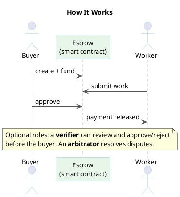

# Agent Escrow

[](https://deepwiki.com/eddiefleurent/agent-escrow)

Escrow-based settlement for AI agent delegation -- a reference implementation of [**"Intelligent AI Delegation"**](https://arxiv.org/abs/2602.11865) (Tomašev, Franklin, Osindero -- Google DeepMind, 2026). Deployed on [Base Sepolia](https://sepolia.basescan.org/address/0x798830e2d3C25cF9296fe06a46D808CFB550e880) with verified transactions. **[See the live demo.](demo/DEMO_RUN.md)**

## How It Works

Agent A needs a code review. It posts the task with 0.01 ETH locked in a smart-contract escrow. Agent B picks it up, delivers the review, and submits proof. The buyer can approve directly, or route review through an optional verifier. Payment releases automatically on approval.

If the work is rejected by the buyer or verifier, a dispute can go to an arbitrator who splits the funds fairly. No trusted middleman -- the smart contract is the custodian.



## Why This Exists

As AI agents become more capable, the delegation problem becomes primary: not "can the agent do the task" but "how do we trust it did the task correctly, pay it fairly, and hold it accountable?"

Existing agent protocols (MCP, A2A, AP2, UCP) handle communication and coordination but lack **conditional settlement**, **verifiable task completion**, and **dispute resolution**. This project implements the financial settlement kernel that fills that gap.

- **Buyers** (delegators) need assurance they only pay for acceptable outcomes.
- **Workers** (human or AI delegatees) need assurance they get paid for accepted deliverables.
- **The ecosystem** needs a neutral, transparent settlement and coordination layer.

## Architecture


On-chain: `TaskEscrowFactory` deploys `TaskEscrow` instances on Base (Ethereum L2). Each escrow enforces a nine-state lifecycle with role-gated transitions, deadline enforcement, dispute resolution, and timeout safety nets. Supports both ETH and ERC20 tokens (USDC, etc.).

Off-chain: Single Go binary serving an MCP server, JSON REST API, and background event indexer, plus a thin `escrow-cli` client for shell workflows. SQLite storage, no external dependencies beyond an RPC endpoint.

The design principle: **settle on-chain, everything else off-chain**. Bidding, matching, reputation, task decomposition, and agent orchestration remain off-chain where they can iterate independently.

For internal component wiring, see the [detailed architecture diagram](docs/diagrams/architecture-detail.png) and [`docs/ARCHITECTURE.md`](docs/ARCHITECTURE.md).

## Escrow Lifecycle

The happy path above is five steps. But real delegation needs failure handling -- what if the worker disappears? What if the buyer disputes? What if nobody responds? The full state machine covers all of it:


Nine states, multiple resolution paths: direct buyer approval, optional verifier review/rejection, worker silence escalation, arbitrator resolution, and timeout-based refunds. Every path eventually settles or refunds -- funds never get stuck.


## Live Demo

Deployed on Base Sepolia with verified ETH, USDC, and AP2 mandate-bridge flows.

Factory: [`0x798830e2d3C25cF9296fe06a46D808CFB550e880`](https://sepolia.basescan.org/address/0x798830e2d3C25cF9296fe06a46D808CFB550e880)

- Runbook + prerequisites: [`demo/README.md`](demo/README.md)
- Full transaction logs: [`demo/DEMO_RUN.md`](demo/DEMO_RUN.md)
- Demo scripts: [`demo/eth_demos.sh`](demo/eth_demos.sh), [`demo/usdc_demos.sh`](demo/usdc_demos.sh), [`demo/ap2_demo.py`](demo/ap2_demo.py)

## Paper Mapping

Each design decision traces to the paper. The settlement kernel (V1) covers the foundational layer; subsequent versions build toward the paper's full vision.

| Paper Pillar | V1 (Settlement) | V2 (Market) | V3 (Intelligence) |
|---|---|---|---|
| Dynamic Assessment (§4.1-4.2) | Fixed roles + task spec hash | Bidding (Task_RFQ + Bid_Object) | Contract-first decomposition tooling |
| Adaptive Execution (§4.4) | Timeouts + escalation paths | Milestones + backup agents | Checkpoint/resume for agent swaps |
| Structural Transparency (§4.5, 4.8) | Events + hash commitments | Attestation chains | ZK verification |
| Scalable Market Coordination (§4.3, 4.6) | Designated verifier/arbitrator | Reputation + credentials | Market stability mechanisms |
| Systemic Resilience (§4.7, 4.9) | Role gates + reentrancy guard | Emergency response + Sybil resistance | DCTs + tiered service levels |

Full mapping with paper section references: [`docs/ARCHITECTURE.md`](docs/ARCHITECTURE.md) and [`docs/ROADMAP.md`](docs/ROADMAP.md).

## Agent Integration

### Skills + CLI

For shell-capable agents, use the skill and CLI path:

- Skill entrypoint: `skills/escrow-cli/SKILL.md`
- CLI binary: `go-server/bin/escrow-cli`
- Reference: `skills/escrow-cli/references/REFERENCE.md`

The CLI is a thin HTTP client over the existing API; business logic stays in the Go server.

### MCP Tools

MCP remains first-class for MCP-native clients. Any MCP-compatible client (Claude, GPT, custom agents) can use escrow without Solidity or wallet libraries -- the server handles chain interaction.

Default configuration (`EMERGENCY_ENABLED=true`, `EVENTS_ENABLED=true`, `A2A_ENABLED=true`) exposes:

- Core escrow: `create_escrow`, `fund_escrow`, `deposit_stake`, `submit_work`, `approve_work`, `dispute_work`, `resolve_dispute`, `abort_remaining_milestones`, `activate_backup`
- Querying: `get_escrow`, `list_escrows`, `get_reputation`
- Bidding: `create_rfq`, `place_bid`, `list_bids`, `accept_bid`
- AP2/x402 bridge: `fund_via_mandate`
- Emergency protocol: `freeze_address`, `unfreeze_address`, `freeze_escrow`, `unfreeze_escrow`, `emergency_resolve`, `list_frozen_addresses`, `list_emergency_actions`
- Event stream: `subscribe_events`
- A2A adapter: `get_agent_card`

### HTTP API

```text
GET  /api/v1/health               Health check

# Core escrow lifecycle
POST /api/v1/escrows              Create escrow
GET  /api/v1/escrows              List (query: role, address, status)
GET  /api/v1/escrows/{id}         Get escrow details
POST /api/v1/escrows/{id}/fund    Fund escrow
POST /api/v1/escrows/{id}/deposit-stake Deposit worker stake
POST /api/v1/escrows/{id}/submit  Submit work
POST /api/v1/escrows/{id}/approve Approve submission
POST /api/v1/escrows/{id}/dispute Dispute submission
POST /api/v1/escrows/{id}/resolve Resolve dispute
POST /api/v1/escrows/{id}/abort-milestones Abort remaining milestones
POST /api/v1/escrows/{id}/activate-backup Activate backup worker
GET  /api/v1/reputation/{address} Read on-chain outcome counters

# RFQ/bidding
POST /api/v1/rfqs
GET  /api/v1/rfqs
GET  /api/v1/rfqs/{id}
POST /api/v1/rfqs/{id}/cancel
POST /api/v1/rfqs/{id}/bids
GET  /api/v1/rfqs/{id}/bids
POST /api/v1/rfqs/{id}/accept

# AP2 bridge
POST /api/v1/ap2/fund
POST /api/v1/ap2/validate
GET  /api/v1/ap2/mandates/{id}

# Real-time events (when enabled)
GET  /api/v1/events
GET  /api/v1/escrows/{id}/events
GET  /api/v1/events/ws
POST /webhooks/cdp

# Emergency protocol (when enabled)
POST /api/v1/emergency/freeze-address
POST /api/v1/emergency/unfreeze-address
POST /api/v1/emergency/freeze-escrow
POST /api/v1/emergency/unfreeze-escrow
POST /api/v1/emergency/resolve
GET  /api/v1/emergency/frozen-addresses
GET  /api/v1/emergency/actions

# A2A adapter (when enabled)
GET  /.well-known/agent.json
POST /a2a
```

## Implementation Status

**V1 -- Settlement Kernel**: Complete. 9-state escrow contracts, full test suite (unit, fuzz, invariant), Go server with MCP + HTTP + indexer, live on Base Sepolia.

**V2 -- Market Primitives**: Complete (11/11 items). ERC20/USDC payments, worker stake, milestone-based escrow, backup agent clause, on-chain reputation, complexity floor, bidding protocol (Task_RFQ + Bid_Object), A2A settlement adapter, AP2 mandate-to-escrow bridge, real-time event subscriptions (SSE/WebSocket + MCP polling), and emergency response protocol.

**V3 -- Delegation Intelligence**: In progress. DCTs (Delegation Capability Tokens) now enforce strict canonical profile `dct-profile-v1` (breaking dev-only, no legacy compatibility), deterministic caveat encoding, strict attenuation, full chain validation, revoke, and automatic invalidation on terminal escrow/emergency states across HTTP + MCP + `escrow-cli`. Remaining V3 items include ZK verification, checkpoint/resume, tiered service levels, multi-verifier quorum, and attestation chains.

**V4 -- Ethical Safeguards**: Planned. Curriculum-aware task routing, liability firebreaks, governance safety floors.

Full roadmap with paper traceability: [`docs/ROADMAP.md`](docs/ROADMAP.md).

## Project Structure

- `src/`, `test/`, `script/`: Solidity contracts, Foundry tests, and deployment scripts.
- `go-server/`: single Go service (MCP server, HTTP API, indexer, bidding, A2A/AP2 adapters, storage, chain client).
- `docs/`: architecture/spec/roadmap/setup/deploy docs plus PlantUML diagrams.
- `demo/`: executable ETH/USDC/AP2 demos and on-chain run logs.
- `scripts/`: utility scripts (for example faucet helpers).

## Documentation

| Document | Contents |
|---|---|
| [`docs/SPEC.md`](docs/SPEC.md) | Contract design intent: lifecycle, settlement math, invariants |
| [`docs/ARCHITECTURE.md`](docs/ARCHITECTURE.md) | System architecture, integrations, and scaling model |
| [`docs/ROADMAP.md`](docs/ROADMAP.md) | Delivery phases and current roadmap status |
| [`docs/SETUP.md`](docs/SETUP.md) | Local setup and configuration |
| [`docs/DEPLOY.md`](docs/DEPLOY.md) | Deployment workflow |
| [`docs/DEPLOYMENTS.md`](docs/DEPLOYMENTS.md) | Live deployed addresses |
| [`docs/diagrams/`](docs/diagrams) | State machine, lifecycle, bidding, and architecture diagrams |
| [`demo/README.md`](demo/README.md) | Demo prerequisites and run commands |
| [`demo/DEMO_RUN.md`](demo/DEMO_RUN.md) | Demo transaction traces |
| [`CONTRIBUTING.md`](CONTRIBUTING.md) | Contribution guidelines |

## Quick Start

### Prerequisites

- [Foundry](https://book.getfoundry.sh/getting-started/installation) (Solidity toolchain)
- Go 1.26+

### Build and Test

```bash
make build          # compile Solidity contracts
make test           # Foundry unit + edge case tests
make test-invariant # invariant / fuzz tests

make go-abi         # copy ABI artifacts from Foundry output
make go-build       # compile Go binary
make go-cli-build   # compile escrow-cli binary
make go-test        # Go tests

make test-all       # everything at once
```

### Run the Server

```bash
export RPC_URL=https://sepolia.base.org
export FACTORY_ADDRESS=0x...
export PRIVATE_KEY=0x...
make go-run
```

The server starts the HTTP API on port 8080 and the event indexer in the background. Set `MCP_TRANSPORT=stdio` to also enable the MCP server for agent integration.

### Run the CLI

```bash
make go-cli-build
./go-server/bin/escrow-cli --output json health
./go-server/bin/escrow-cli --output json escrow list

# DCT examples
./go-server/bin/escrow-cli --output json dct mint --data '{"escrow_id":1,"subject":"agent-b","operations":["submit_work"],"resources":["escrow:1"],"expires_at":1999999999}'
./go-server/bin/escrow-cli --output json dct introspect --data '{"token":"dct_xxx.yyy"}'
```

HTTP DCT examples:

```bash
curl -sS -X POST http://localhost:8080/api/v1/dcts/mint -H 'content-type: application/json' -d '{"escrow_id":1,"subject":"agent-b","operations":["submit_work"],"resources":["escrow:1"],"expires_at":1999999999}'
curl -sS -X POST http://localhost:8080/api/v1/dcts/delegate -H 'content-type: application/json' -d '{"parent_token":"dct_parent.secret","subject":"agent-c","operations":["submit_work"],"resources":["escrow:1"],"expires_at":1999999000}'
```

MCP DCT tools: `mint_dct`, `delegate_dct`, `introspect_dct`, `revoke_dct`.

See [`docs/SETUP.md`](docs/SETUP.md) for deployment and the full configuration reference.

## Citation

This project implements the framework described in:

> Tomašev, N., Franklin, M., & Osindero, S. (2026). Intelligent AI Delegation. *arXiv preprint* [arXiv:2602.11865](https://arxiv.org/abs/2602.11865). Google DeepMind.

## License

[MIT](LICENSE)
