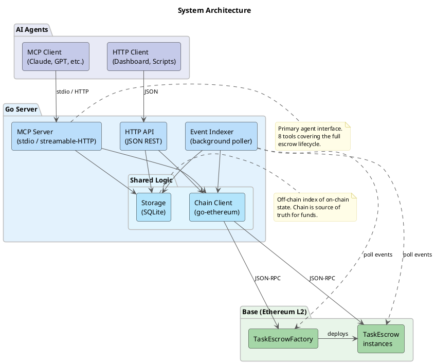
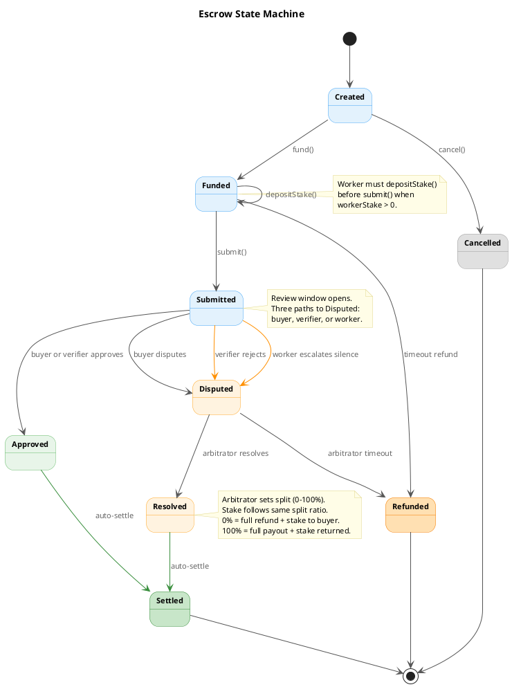
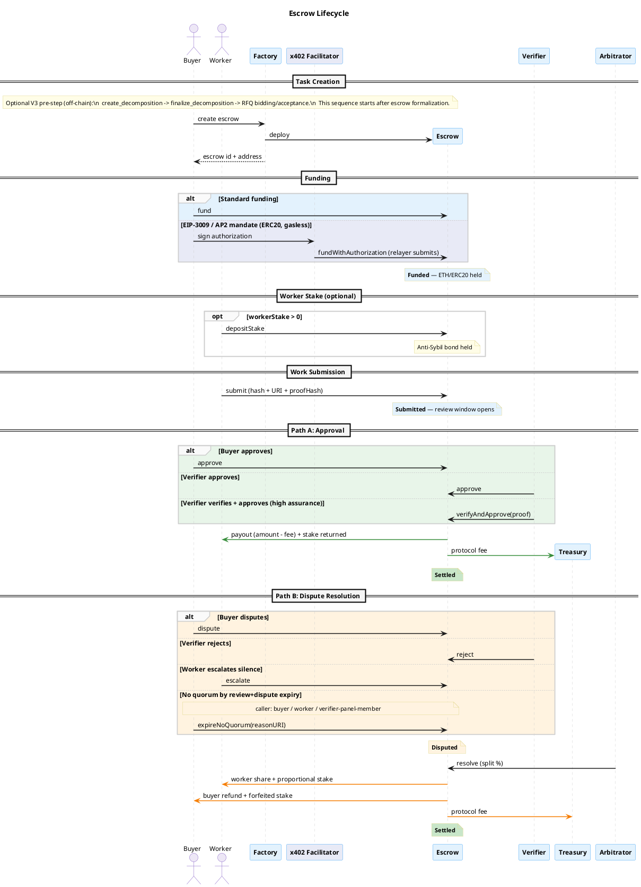

# Agent Escrow

[](https://deepwiki.com/eddiefleurent/agent-escrow)

Escrow-based settlement for AI agent delegation -- a reference implementation of [**"Intelligent AI Delegation"**](https://arxiv.org/abs/2602.11865) (Tomašev, Franklin, Osindero -- Google DeepMind, 2026).

The paper defines a framework for task decomposition, delegation, verification, and settlement in open agentic economies. It identifies a critical gap: existing agent protocols (MCP, A2A, AP2, UCP) handle communication and coordination but lack **conditional settlement**, **verifiable task completion**, and **dispute resolution**. This project implements the financial settlement kernel that fills that gap, and builds toward the paper's full vision across four delivery phases.

Deployed and tested on Base Sepolia. **[See the live demo with on-chain transactions.](docs/DEMO_RUN.md)**

## Why This Exists

As AI agents become more capable, the delegation problem becomes primary: not "can the agent do the task" but "how do we trust it did the task correctly, pay it fairly, and hold it accountable?"

- **Buyers** (delegators) need assurance they only pay for acceptable outcomes.
- **Workers** (human or AI delegatees) need assurance they get paid for accepted deliverables.
- **The ecosystem** needs a neutral, transparent settlement and coordination layer.

Smart-contract escrow solves this by making payment conditional on verified completion, with dispute resolution as a fallback. The contract is the custodian -- not a marketplace operator, not a trusted third party.

## Architecture



On-chain: `TaskEscrowFactory` deploys `TaskEscrow` instances on Base (Ethereum L2). Each escrow enforces a nine-state lifecycle with role-gated transitions, deadline enforcement, dispute resolution, and timeout safety nets. Supports both ETH and ERC20 tokens (USDC, etc.).

Off-chain: Single Go binary serving an MCP server (primary agent interface), JSON REST API, and background event indexer. SQLite storage, no external dependencies beyond an RPC endpoint.

The design principle: **settle on-chain, everything else off-chain**. Bidding, matching, reputation, task decomposition, and agent orchestration remain off-chain where they can iterate independently.

## Escrow Lifecycle

Each escrow follows a nine-state machine with multiple resolution paths:



The happy path is straightforward: create, fund, submit, approve, settle. But real delegation needs failure handling -- the state machine covers buyer disputes, verifier rejections, worker silence escalation, arbitrator resolution, and timeout-based refunds.



## Live Demo

Both ETH and USDC escrow lifecycles have been executed on Base Sepolia with real transactions:

**ETH escrow** — same flow as V1, through the V2 contract:

| Step | Tx |
|---|---|
| Create escrow (0.0001 ETH) | [`0xa683274...`](https://sepolia.basescan.org/tx/0xa683274e88c7ca872494cca49f91bdb37cd4ab8f11a65b56dbea216b0eb2f18d) |
| Fund | [`0x9a81cde...`](https://sepolia.basescan.org/tx/0x9a81cdeaba9e8b14f7094c9294e72f734d86bf73ceffe71918d0f6272b9dc3e7) |
| Submit work | [`0xfbb5232...`](https://sepolia.basescan.org/tx/0xfbb52326a459ecb16713a2d1428f39ddc6e259086e00cf0f776c678972dd92de) |
| Approve + settle | [`0x163e4d4...`](https://sepolia.basescan.org/tx/0x163e4d49fb4a86add4cd745b32f3e20a7753766465a3a4ca426e636dc113e33d) |

**USDC escrow** — new in V2, buyer approves ERC20 spend then funds:

| Step | Tx |
|---|---|
| Create escrow (1 USDC) | [`0x0a2711a...`](https://sepolia.basescan.org/tx/0x0a2711ad0769b681a393e76485fb9489d2c505db097e7db63b28a43e05a2e44f) |
| Approve USDC spend | [`0x8e2b194...`](https://sepolia.basescan.org/tx/0x8e2b1947f56bd3490ee7a91923c145b93924c8b2e51bcb5930cfebc10d623ac6) |
| Fund | [`0x583171a...`](https://sepolia.basescan.org/tx/0x583171a30cf58f9854ec318a5c0dcc4fe964debecbc235b0610024c1797deb4b) |
| Submit work | [`0xc2ff284...`](https://sepolia.basescan.org/tx/0xc2ff2840ff82803d46f998f51e253d6fa904d1ca14c581081c052cbe6d869509) |
| Approve + settle | [`0xc82b071...`](https://sepolia.basescan.org/tx/0xc82b071f0baf91bb024a2702c9c141f6c9f6dba7a11f79261f4589de4758c023) |

Factory: [`0x798830e2d3C25cF9296fe06a46D808CFB550e880`](https://sepolia.basescan.org/address/0x798830e2d3C25cF9296fe06a46D808CFB550e880) on Base Sepolia.

Full details (including V1 history): [`docs/DEMO_RUN.md`](docs/DEMO_RUN.md)

## Paper Mapping

Each design decision traces to the paper. The settlement kernel (V1) covers the foundational layer; subsequent versions build toward the paper's full vision.

| Paper Pillar | V1 (Settlement) | V2 (Market) | V3 (Intelligence) |
|---|---|---|---|
| Dynamic Assessment (§4.1-4.2) | Fixed roles + task spec hash | Bidding (Task_RFQ + Bid_Object) | Contract-first decomposition tooling |
| Adaptive Execution (§4.4) | Timeouts + escalation paths | Milestones + backup agents | Checkpoint/resume for agent swaps |
| Structural Transparency (§4.5, 4.8) | Events + hash commitments | Attestation chains | ZK verification |
| Scalable Market Coordination (§4.3, 4.6) | Designated verifier/arbitrator | Reputation + credentials | Market stability mechanisms |
| Systemic Resilience (§4.7, 4.9) | Role gates + reentrancy guard | DCTs + Sybil resistance | Tiered service levels |

Full mapping with paper section references: [`docs/ARCHITECTURE.md`](docs/ARCHITECTURE.md) and [`docs/ROADMAP.md`](docs/ROADMAP.md).

## Quick Start

### Prerequisites

- [Foundry](https://book.getfoundry.sh/getting-started/installation) (Solidity toolchain)
- Go 1.26+

### Build and Test

```bash
make build          # compile Solidity contracts
make test           # Foundry unit + edge case tests
make test-invariant # invariant / fuzz tests

make go-abi         # copy ABI artifacts from Foundry output
make go-build       # compile Go binary
make go-test        # Go tests

make test-all       # everything at once
```

### Run the Server

```bash
export RPC_URL=https://sepolia.base.org
export FACTORY_ADDRESS=0x...
export PRIVATE_KEY=0x...
make go-run
```

The server starts the HTTP API on port 8080 and the event indexer in the background. Set `MCP_TRANSPORT=stdio` to also enable the MCP server for agent integration.

See [`docs/SETUP.md`](docs/SETUP.md) for the full configuration reference.

### Deploy to Base Sepolia

```bash
export PRIVATE_KEY=0x...
export TREASURY=0x...
export OWNER=0x...
export PROTOCOL_FEE_BPS=100
export BASE_SEPOLIA_RPC_URL=https://sepolia.base.org
make deploy-base-sepolia
```

## Agent Integration

### MCP Tools

The MCP server is the primary interface for AI agents. Any MCP-compatible client (Claude, GPT, custom agents) can use escrow without Solidity or wallet libraries -- the server handles chain interaction.

| Tool | Description |
|---|---|
| `create_escrow` | Create task + escrow via factory (ETH or ERC20) |
| `fund_escrow` | Buyer funds escrow |
| `submit_work` | Worker submits hash + URI |
| `approve_work` | Buyer or verifier approves |
| `dispute_work` | Buyer disputes or verifier rejects |
| `resolve_dispute` | Arbitrator resolves with BPS split |
| `get_escrow` | Read escrow state |
| `list_escrows` | Filter by role, address, or status |

### HTTP API

```text
GET  /api/v1/health               Health check
POST /api/v1/escrows              Create escrow
GET  /api/v1/escrows              List (query: role, address, status)
GET  /api/v1/escrows/{id}         Get escrow details
POST /api/v1/escrows/{id}/fund    Fund escrow
POST /api/v1/escrows/{id}/submit  Submit work
POST /api/v1/escrows/{id}/approve Approve submission
POST /api/v1/escrows/{id}/dispute Dispute submission
POST /api/v1/escrows/{id}/resolve Resolve dispute
```

## Implementation Status

**V1 -- Settlement Kernel**: Complete. Contracts deployed, full test suite (unit, fuzz, invariant), Go server with MCP + HTTP + indexer, live on Base Sepolia.

**V2 -- Market Primitives**: In progress. ERC20/USDC payment support is complete. Next: worker stake, milestone-based escrow, backup agent clause, on-chain reputation, bidding protocol.

**V3 -- Delegation Intelligence**: Planned. DCTs, ZK verification, checkpoint/resume, tiered service levels, multi-verifier quorum.

**V4 -- Ethical Safeguards**: Planned. Curriculum-aware task routing, liability firebreaks, governance safety floors.

Full roadmap with paper traceability: [`docs/ROADMAP.md`](docs/ROADMAP.md).

## Project Structure

```text
src/                    Solidity contracts (TaskEscrowFactory, TaskEscrow)
test/                   Foundry tests (unit, fuzz, invariant)
script/                 Deployment scripts
go-server/
  cmd/server/           Entrypoint
  internal/
    chain/              go-ethereum client, ABI bindings
    storage/            SQLite schema, queries, models
    indexer/            Event polling → DB reconciliation
    mcpserver/          MCP server + tool handlers
    api/                HTTP JSON API + middleware
  abi/                  Embedded ABI artifacts
docs/
  diagrams/             PlantUML sources + generated PNGs
  ARCHITECTURE.md       System design, paper grounding, scalability analysis
  SPEC.md               Contract specification: state machine, interfaces, invariants
  ROADMAP.md            Delivery phases, paper framework mapping
  SETUP.md              Environment setup, configuration reference
  DEMO_RUN.md           Live demo — transactions on Base Sepolia
  DEPLOYMENTS.md        Deployed contract addresses
  DEPLOY.md             Deployment guide and lifecycle walkthrough
```

## Documentation

| Document | Contents |
|---|---|
| [`docs/ARCHITECTURE.md`](docs/ARCHITECTURE.md) | System design, paper grounding, scalability analysis |
| [`docs/SPEC.md`](docs/SPEC.md) | Contract specification: state machine, interfaces, invariants, security |
| [`docs/ROADMAP.md`](docs/ROADMAP.md) | Implementation phases, paper framework mapping, success metrics |
| [`docs/SETUP.md`](docs/SETUP.md) | Environment setup, configuration reference |
| [`docs/DEMO_RUN.md`](docs/DEMO_RUN.md) | Live demo run with on-chain transactions |
| [`docs/DEPLOYMENTS.md`](docs/DEPLOYMENTS.md) | Deployed contract addresses |
| [`CONTRIBUTING.md`](CONTRIBUTING.md) | Contribution guidelines |

## Citation

This project implements the framework described in:

> Tomašev, N., Franklin, M., & Osindero, S. (2026). Intelligent AI Delegation. *arXiv preprint* [arXiv:2602.11865](https://arxiv.org/abs/2602.11865). Google DeepMind.

## License

[MIT](LICENSE)
