# Live Demo — Base Sepolia

These are real escrow lifecycles executed on Base Sepolia -- every transaction is on-chain and verifiable. Click any tx hash to see it on [BaseScan](https://sepolia.basescan.org).

**What you're seeing:** A buyer posts a task and locks funds in escrow. A worker picks it up and submits proof of completion. The buyer approves, and the smart contract automatically pays the worker (minus a 1% protocol fee). No intermediary touches the funds -- the contract is the custodian from start to finish.

Six demo sets below:
- **Codex Agent Demo** (2026-02-24) -- two Codex agents (buyer + worker) coordinate autonomously through the full escrow lifecycle: RFQ → bid → accept → fund → submit → approve → settle.
- **V2 Full Feature Demos** (2026-02-22) -- seven scenarios exercising all 11 V2 market primitives with ETH: worker stake, milestones, disputes, backup agents, bidding, reputation, and emergency response.
- **V2 Full Feature Demos USDC** (2026-02-22) -- the same seven scenarios re-run with USDC (ERC20), proving full token parity.
- **AP2 Mandate Bridge Demo** (2026-02-22) -- gasless EIP-3009 `receiveWithAuthorization` funding via the AP2 mandate-to-escrow bridge.
- **V2 ETH + USDC** (2026-02-20) -- basic happy-path demos in ETH and USDC.
- **V1 Settlement Kernel** (2026-02-20) -- the original ETH-only deployment.

---

## V3 Baseline Demo Plan (2026-03-04)

This plan is the execution baseline before Phase 2 roadmap revisits (`R1`-`R4`). The goal is to prove current V3 behavior on live Base Sepolia, then iterate hardening from a known-good checkpoint.

### Scope

- Defer `demo/run-escrow-agent-demo.sh` until SH5 client-side signing lands; the current single-server signer model is not the target real multi-party demo architecture.
- Run legacy regression sets:
  - `demo/eth_demos.sh`
  - `demo/usdc_demos.sh`
  - `demo/ap2_demo.py`
- Capture all produced tx hashes, escrow addresses, and output artifacts.

### Environment and preflight

1. Source `.env`.
2. Confirm required tools: `cast`, `jq`, `curl`, `python3`, `escrow-cli`, `codex`.
3. Start server with fresh DB and wait for indexer sync:
   ```bash
   lsof -ti :8080 | xargs kill -9 2>/dev/null || true
   rm -f go-server/delegation.db*
   set -a && source .env && set +a
   (cd go-server && ./bin/server > /tmp/agent-escrow-server.log 2>&1 &)
   sleep 30
   ```
4. Confirm API health:
   ```bash
   curl -sf http://localhost:8080/api/v1/health
   ```

### Acceptance criteria

- Every planned run either:
  - completes with settled or expected terminal states and mined txs, or
  - fails with a recorded, actionable blocker (funding, key, RPC, auth, or infra).
- Artifact files are produced and preserved:
  - `/tmp/v2_demo_results.json`
  - `/tmp/v2_usdc_demo_results.json`
  - AP2 output JSON path (script-selected temp file unless overridden)
  - `demo/runtime/agent-state/buyer-agent.log` (only for legacy agent-demo reruns)
- This document is updated with:
  - date/time of run
  - commit SHA used
  - pass/fail per run
  - blocker list (if any)

### Execution log template

| Run | Command | Start (UTC) | End (UTC) | Result | Artifacts / Notes |
|---|---|---|---|---|---|
| Agent demo (deferred pending SH5) | `bash demo/run-escrow-agent-demo.sh` | `TBD` | `TBD` | `blocked` | `demo/runtime/agent-state/*` |
| V2 ETH regression | `bash demo/eth_demos.sh` | `TBD` | `TBD` | `pending` | `/tmp/v2_demo_results.json` |
| V2 USDC regression | `bash demo/usdc_demos.sh` | `TBD` | `TBD` | `pending` | `/tmp/v2_usdc_demo_results.json` |
| AP2 regression | `uv run demo/ap2_demo.py` | `TBD` | `TBD` | `pending` | `tempfile or AP2_RESULTS_FILE` |

### Execution log (2026-03-04, V3 refresh)

| Run | Result | Notes |
|---|---|---|
| ETH full feature (`demo/eth_demos.sh`) | `pass` | Demos C-I completed against current V3 API/contract flow (sealed bidding commit/reveal, backup activation, emergency). |
| USDC full feature (`demo/usdc_demos.sh`) | `pass (completed with one manual resume after operator interrupt)` | C-F completed in-script; G settled (`escrow_id=83`), H reputation snapshot captured, I emergency flow completed (`escrow_id=84`). |
| AP2 (`demo/ap2_demo.py`) | `pass` | Completed with timeout guard; escrow `86`, mandate `7172ec61b82fc20b`, final status `settled`. |

Key USDC V3 references from this run:
- Demo G escrow: `escrow_id=83`, status `settled`.
- Demo I escrow: `escrow_id=84`, freeze tx `0x008b633601e59b08859249d21356fc534f3903583d90669502b0ea304dd0e7c4`, resolve tx `0xd4c0b75d03fca664d15574ea92ffeec38d6751546f119cbe3c1e858bc8284040`.

### Immediate next after baseline

- Start roadmap Phase 2 revisits in order: `R1 -> R2 -> R3 -> R4`.
- After at least one revisit lands, run a short "V3.1 hardening demo" and append a new dated section below.

---

## Parity Demo Plan — HTTP vs CLI vs MCP (+ UCP)

Purpose: demonstrate interface parity by running equivalent escrow lifecycles through all three primary access paths:
- HTTP API
- `escrow-cli`
- MCP tools (agent-driven, Codex or Claude)

UCP is included as an adapter demo to show checkout-to-escrow compatibility.

### Scope

Three parity scenarios:
1. **Parity A (ETH happy path)**  
   `create -> fund -> submit -> approve -> settled`
2. **Parity B (ETH bidding path)**  
   `create RFQ -> commit -> reveal -> accept -> fund -> submit -> approve -> settled`
3. **Parity C (cross-interface handoff)**  
   same lifecycle, but each step intentionally performed via a different interface.

One adapter scenario:
1. **UCP adapter flow**  
   `UCP checkout` creates/funds escrow, then continue lifecycle via HTTP/CLI/MCP.

### Preflight (all lanes)

1. Source environment:
   ```bash
   set -a && source .env && set +a
   ```
2. Verify health:
   ```bash
   curl -sf "$BASE_URL/api/v1/health"
   ```
3. Confirm tooling:
   ```bash
   cast --version
   escrow-cli --version
   ```
4. Confirm buyer/worker addresses resolve from keys (no hardcoded role drift).

### Setup contract (before any parity run)

Use this as a strict setup checklist so every lane runs against identical assumptions.

1. Required env keys must be present:
   - `BASE_URL`
   - `PRIVATE_KEY`
   - `WORKER_KEY`
   - `VERIFIER_KEY`
   - `ARBITRATOR_KEY`
   - `BACKUP_KEY` (or `BACKUP_WORKER_KEY`)
2. Resolve and print role addresses from keys (do not hardcode role addresses):
   ```bash
   BUYER=$(cast wallet address --private-key "$PRIVATE_KEY")
   WORKER=$(cast wallet address --private-key "$WORKER_KEY")
   VERIFIER=$(cast wallet address --private-key "$VERIFIER_KEY")
   ARBITRATOR=$(cast wallet address --private-key "$ARBITRATOR_KEY")
   BACKUP=$(cast wallet address --private-key "${BACKUP_KEY:-$BACKUP_WORKER_KEY}")
   printf "BUYER=%s\nWORKER=%s\nVERIFIER=%s\nARBITRATOR=%s\nBACKUP=%s\n" \
     "$BUYER" "$WORKER" "$VERIFIER" "$ARBITRATOR" "$BACKUP"
   ```
3. Confirm API chain/factory context is expected:
   ```bash
   curl -sf "$BASE_URL/api/v1/health"
   ```
4. Confirm buyer has ETH gas headroom for full sequence.
5. For USDC/AP2/UCP runs, confirm USDC balances for all participating signers.
6. Verify emergency endpoints are configured if demo includes emergency paths (`OWNER_ADDRESS` present server-side).
7. Run automated preflight:
   ```bash
   # ETH lanes
   bash demo/preflight_parity.sh
   # USDC/AP2/UCP lanes
   bash demo/preflight_parity.sh --require-usdc
   ```
8. Initialize a parity results file:
   ```bash
   cp demo/parity_results.template.json /tmp/parity_results.json
   ```

### Safety and logging guardrails

1. Never print or copy private keys into logs, markdown, or screenshots.
2. Only log:
   - addresses
   - ids
   - tx hashes
   - final statuses
3. Use redacted env dumps if troubleshooting (`env | grep KEY` is disallowed).
4. Keep output artifacts in temp files (`/tmp/...`) and copy only non-secret fields into docs.
5. Run secret guardrail scan before any commit:
   ```bash
   bash demo/check_no_secrets.sh
   ```

### Standard timeout wrappers

Use explicit hard timeouts for all demo entrypoints:

```bash
timeout 900 bash demo/eth_demos.sh
timeout 900 bash demo/usdc_demos.sh
timeout 900 uv run demo/ap2_demo.py
```

For manual API sequences, wrap long waits with bounded loops and absolute cutoffs.

### Lane launch templates

These are setup templates only; replace placeholders per scenario run sheet.

#### HTTP lane template

```bash
set -a && source .env && set +a
export BASE_URL="${BASE_URL:-http://localhost:8080}"
timeout 900 bash demo/eth_demos.sh
```

#### CLI lane template

```bash
set -a && source .env && set +a
export BASE_URL="${BASE_URL:-http://localhost:8080}"
# example only; use scenario-specific CLI sequence
escrow-cli health
```

#### MCP lane template (Codex or Claude)

```bash
set -a && source .env && set +a
export BASE_URL="${BASE_URL:-http://localhost:8080}"
# start agent with MCP-enabled profile and deterministic prompt for the scenario
```

#### UCP adapter template

```bash
set -a && source .env && set +a
export BASE_URL="${BASE_URL:-http://localhost:8080}"
# create checkout -> complete checkout -> continue escrow lifecycle via HTTP/CLI/MCP
```

### Lane A — HTTP baseline

Run with HTTP endpoints plus `cast` for non-server signers:
- Use existing scripts or minimal explicit calls for Parity A/B/C.
- Record:
  - escrow IDs and addresses
  - RFQ and bid IDs (for bidding path)
  - all tx hashes
  - terminal status

### Lane B — CLI-only

Run equivalent flow using `escrow-cli` commands only:
- Parity A:
  - create escrow
  - fund
  - submit
  - approve
- Parity B:
  - create RFQ
  - bid commit/reveal
  - accept
  - fund/submit/approve
- Capture same IDs/hashes/status as HTTP lane.

### Lane C — MCP-only (agent)

Use Codex or Claude with MCP tools enabled:
- Buyer and worker prompts are constrained to deterministic task checklists.
- No manual intervention except start/stop and log capture.
- Execute Parity A and B in MCP tools only.
- Capture tool outputs + tx hashes + final status.

### Parity C — Cross-interface handoff

One demo where each stage uses a different interface, for example:
1. create via HTTP
2. fund via CLI
3. submit via MCP
4. approve via HTTP

Pass if lifecycle settles cleanly and economics match single-lane runs.

### UCP adapter demo

Separate from the three primary lanes:
1. Create checkout via UCP endpoint.
2. Complete checkout to produce escrow/funding side effects.
3. Continue submit/approve through one primary lane (HTTP, CLI, or MCP).
4. Verify resulting escrow state and payouts are equivalent to non-UCP flow.

### Pass criteria

For each parity scenario:
1. Terminal state is `settled` (or expected terminal state if dispute flow is intentionally used).
2. Economic outcomes match within deterministic fee math:
   - protocol fee
   - worker payout
   - refunds/stake return where applicable
3. Role authorization is consistent (no interface bypass of role/state guards).
4. No interface-specific behavior regressions (same logical outcome across lanes).

### Artifacts to retain

1. Per-lane JSON result files (IDs + tx hashes).
2. MCP transcript/log for agent lane.
3. Final comparison table appended here:

| Scenario | HTTP | CLI | MCP | UCP | Notes |
|---|---|---|---|---|---|
| Parity A | `pending` | `pending` | `pending` | `n/a` | |
| Parity B | `pending` | `pending` | `pending` | `n/a` | |
| Parity C | `pending` | `pending` | `pending` | `n/a` | |
| UCP adapter | `pending` | `optional` | `optional` | `pending` | |

---

## Codex Agent Demo (2026-02-24)

Factory: [`0x7006930a9d309ca476b5538800da16525ecb191d`](https://sepolia.basescan.org/address/0x7006930a9d309ca476b5538800da16525ecb191d)

Two autonomous Codex agents ran the full escrow lifecycle with no human intervention. The buyer agent posted an RFQ and waited; the worker agent discovered the RFQ, placed a bid, and submitted work independently; the buyer agent accepted the bid, funded the escrow, and approved on settlement. Each agent operated from its own prompt file (`demo/agents/codex-buyer-agent.md`, `demo/agents/codex-worker-agent.md`) and was launched by an orchestrator script (`demo/run-escrow-agent-demo.sh`).

This historical run used the older single-server signer topology. It remains useful as an early proof-of-concept, but it is not the final "real multi-party demo" target described by SH5 in the roadmap.

This is the architecture described in the paper (§6.1): a buyer broadcasts a `Task_RFQ`, a worker responds with a signed `Bid_Object`, and the smart contract enforces payment on approval. Both agents are instances of `gpt-5.3-codex` (Codex v0.104.0).

**Participants:**

| Role | Agent | Address |
|------|-------|---------|
| Buyer | Codex (background process, server signing key) | `0xA52bd5190B344445d91877c7E1e1a11718A205d1` |
| Worker | Codex (foreground process, own key) | `0x13c010aC7cf2bd187adAfEAd2D73E52fF48765e2` |
| Verifier | — (unused in happy path) | `0x2197e5122d81F544a57DEF921414610e7D66bd98` |
| Arbitrator | — (unused in happy path) | `0x0Ee4aa0CAa6974076b85E219835FB54B960Bc8c8` |

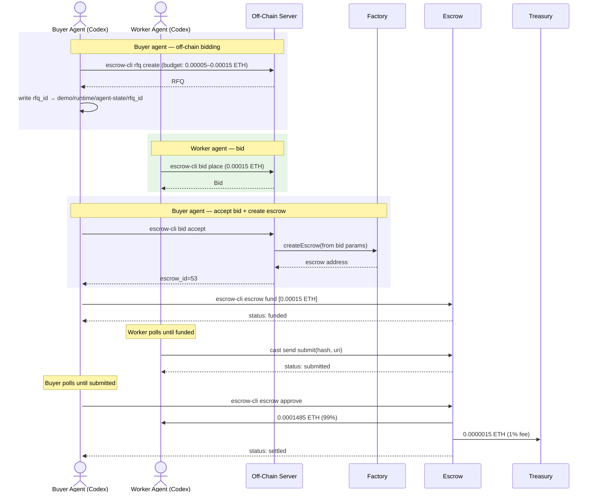

| | Address / ID |
|---|---|
| RFQ | #4 (off-chain) |
| Bid | #3 (off-chain) |
| Escrow | [`0xB044CdF24682bD29e3Af5eaF74c9068Cf5026b78`](https://sepolia.basescan.org/address/0xB044CdF24682bD29e3Af5eaF74c9068Cf5026b78) |

| Step | Agent | Tx Hash |
|---|---|---|
| Accept bid → create escrow | Buyer | [`0x5016b3a...`](https://sepolia.basescan.org/tx/0x5016b3a075ea595fdd3d9071a0dedd9514676af3fdaf357af98cc1c476c262b1) |
| Fund (0.00015 ETH) | Buyer | [`0x54308d4...`](https://sepolia.basescan.org/tx/0x54308d4650e93f1ea4643d1032c1c9dd0f58ca843f13a9f7ec199318e2b1a19c) |
| Submit work | Worker | [`0x846503f...`](https://sepolia.basescan.org/tx/0x846503f4c114561a7b41461849ecd0cfa00e4b3c5f2fe5d0aa8172048cdbde3d) |
| Approve + settle | Buyer | [`0x4d50932...`](https://sepolia.basescan.org/tx/0x4d50932601bbc204390cc125573385b1fdccc2e5d588fd414846fa557e9a6825) |

**Settlement math:**

| | Amount |
|---|---|
| Escrow amount | 0.00015 ETH (150000000000000 wei) |
| Protocol fee (1%) | 0.0000015 ETH |
| Worker payout (99%) | 0.0001485 ETH |
| Final escrow balance | 0 |

**What makes this different from prior demos:** every prior demo was scripted by a human operator. Here, both sides of the negotiation — posting the task, reading the RFQ, placing the bid, deciding to accept, funding, submitting, and approving — were performed by autonomous agents acting on plain-language prompts with no human in the loop. The `submit()` transaction is signed by the worker's own key, not the server's, because the contract enforces `msg.sender == activeWorker`.

---

## V2 — Full Feature Demos (2026-02-22)

Factory: [`0x7006930a9d309ca476b5538800da16525ecb191d`](https://sepolia.basescan.org/address/0x7006930a9d309ca476b5538800da16525ecb191d)

Seven demo scenarios exercising every V2 market primitive on Base Sepolia with real on-chain transactions. Each demo targets specific features from the [roadmap](../docs/ROADMAP.md) and traces back to the paper's framework.

**Participants:**

| Role | Address |
|---|---|
| Buyer / Owner | `0x458397fDDB048239Ab033054d3F70919a95cF4d3` |
| Worker | `0x9A085AC334a38F0C2881615003FFeD3C7E5Ac7F6` |
| Verifier | `0xEa62Afd342704CF52A48A50BC5a7e57B45e3de7A` |
| Arbitrator | `0x98586bC45A9D6B9D2C5F11292d4a9bfA4a50b097` |
| Backup Worker | `0x3f044Bd753c7a40c385Cf80790c056C07138bA05` |

### Demo C: Worker Stake + Happy Path (V2.2)

**Features exercised:** worker stake deposit, stake return on approval (paper §4.8: delegatee posts financial stake into escrow prior to execution)

The worker deposits an anti-Sybil bond before submitting. On approval, the stake is returned in full alongside the payment.

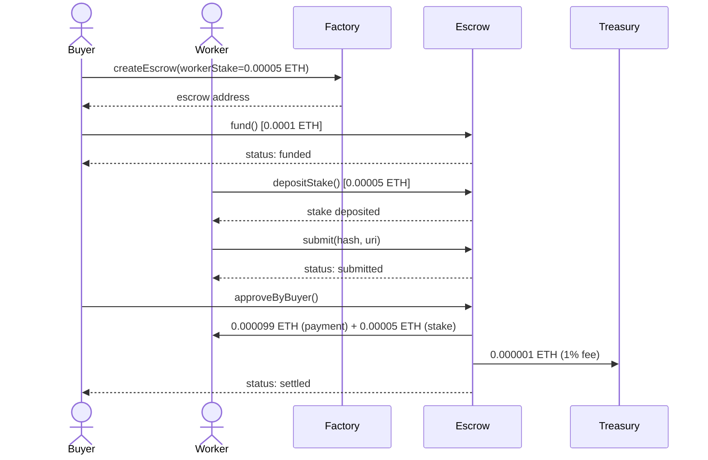

| | Address |
|---|---|
| Escrow | [`0x36aA98C98DebFdE0B61e252Ba75F5F0874053446`](https://sepolia.basescan.org/address/0x36aA98C98DebFdE0B61e252Ba75F5F0874053446) |

| Step | Tx Hash |
|---|---|
| Create escrow | [`0x3968bdc...`](https://sepolia.basescan.org/tx/0x3968bdc929e2c1e73195a2d6e9587deef8825a17fddcf57c085bf728957f4bec) |
| Fund (0.0001 ETH) | [`0xd48b6b7...`](https://sepolia.basescan.org/tx/0xd48b6b7507f5cb90ba9671e019cf309acb130c7ff6718a8f8d5dd02fa66cb64c) |
| Deposit stake (0.00005 ETH) | [`0x1cf2150...`](https://sepolia.basescan.org/tx/0x1cf215006152cd28319615a4e6c3849cdd9f0eef43c240eea7bab413231a59ec) |
| Submit work | [`0x30d1b04...`](https://sepolia.basescan.org/tx/0x30d1b04f337d1af4fdc08cbad53a9ee042579ce0a35bed78016d6d752bd231b4) |
| Approve + settle | [`0x2e1f894...`](https://sepolia.basescan.org/tx/0x2e1f8941dca5d25be0123a1ed6c0828b79c6e327c559d91ecfec75597894ba2f) |

**Settlement math:**

| | Amount |
|---|---|
| Escrow amount | 0.0001 ETH |
| Worker stake | 0.00005 ETH |
| Protocol fee (1%) | 0.000001 ETH |
| Worker payout | 0.000099 ETH (payment) + 0.00005 ETH (stake) = 0.000149 ETH |
| Treasury | 0.000001 ETH |
| Final escrow balance | 0 |

### Demo D: Milestone Escrow — Happy Path (V2.3)

**Features exercised:** milestone creation, per-milestone submit/approve, partial payouts, sequential processing (paper §4.4: smart contracts with pre-agreed executable clauses; §4.5: commit to publishing key progress milestones)

Three milestones processed sequentially. Each milestone pays out immediately on approval -- the worker doesn't wait for the entire task to complete.

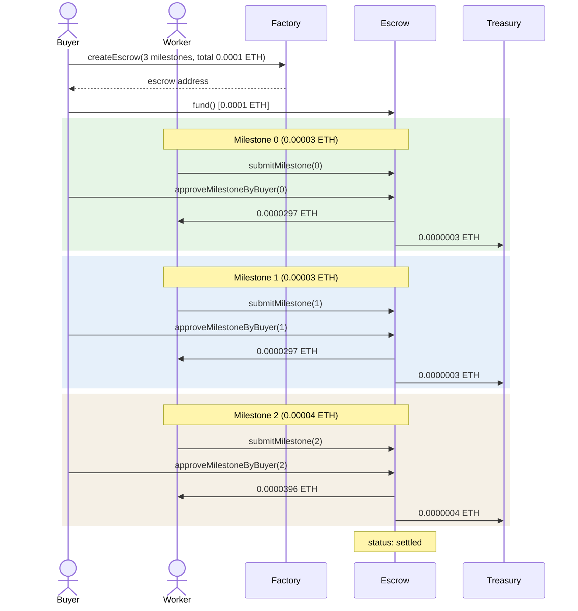

| | Address |
|---|---|
| Escrow | [`0x6e2C91A62e0EF7Ba8fABf6991Ecdb7Ee7cbB316c`](https://sepolia.basescan.org/address/0x6e2C91A62e0EF7Ba8fABf6991Ecdb7Ee7cbB316c) |

| Step | Tx Hash |
|---|---|
| Create escrow | [`0x275eb8b...`](https://sepolia.basescan.org/tx/0x275eb8b2875f2dc22be5e92cce4163f54ff6aab791dcf69b42ebb3ff12fa2a28) |
| Fund (0.0001 ETH) | [`0xddbe8d5...`](https://sepolia.basescan.org/tx/0xddbe8d5a3325dbe3e6304676d41a8ef3de0a38ec5ef6fd85298772eeee1d9ae0) |
| M0: Submit | [`0x7ad6384...`](https://sepolia.basescan.org/tx/0x7ad638498f486adcbe3b6ab1ea4785e8d6cc33128a82fc8f820275439b50301c) |
| M0: Approve | [`0x4457141...`](https://sepolia.basescan.org/tx/0x4457141eb4e1db89bc9ecf3e286245ec24cb0a8c8aa6cba2b8efaf24ae42a9ed) |
| M1: Submit | [`0x3a55820...`](https://sepolia.basescan.org/tx/0x3a5582b07fc59d50ae7ffc63fdc85e918d898429b54090e46eb9750328de401f) |
| M1: Approve | [`0xd135e75...`](https://sepolia.basescan.org/tx/0xd135e750e97a2c4c4e5399d29d65fd8cdae688739bc8a931cf9342e3ecc64f53) |
| M2: Submit | [`0x3a7a2fa...`](https://sepolia.basescan.org/tx/0x3a7a2fa42821ef4a64f6173f9c730c9ff67b8a5a7e21060b3920f0cd04ff228b) |
| M2: Approve + settle | [`0x55f7ea5...`](https://sepolia.basescan.org/tx/0x55f7ea54221e006e4079a5eae3bc7f0c4509508e533ac9683885a681cbcbca5d) |

**Settlement math per milestone:**

| Milestone | Amount | Worker Payout (99%) | Treasury (1%) |
|---|---|---|---|
| M0 | 0.00003 ETH | 0.0000297 ETH | 0.0000003 ETH |
| M1 | 0.00003 ETH | 0.0000297 ETH | 0.0000003 ETH |
| M2 | 0.00004 ETH | 0.0000396 ETH | 0.0000004 ETH |
| **Total** | **0.0001 ETH** | **0.000099 ETH** | **0.000001 ETH** |

### Demo E: Milestone + Dispute + Abort (V2.3 + V2.4)

**Features exercised:** milestone dispute, arbitrator resolution with partial split, `abortRemainingMilestones`, worker stake settlement (paper §4.4: adaptive coordination; §4.8: dispute resolution)

M0 succeeds. M1 is disputed and resolved with a 50/50 split. The buyer aborts M2, recovering funds for uncompleted work. Worker stake is settled proportionally based on milestone outcomes.

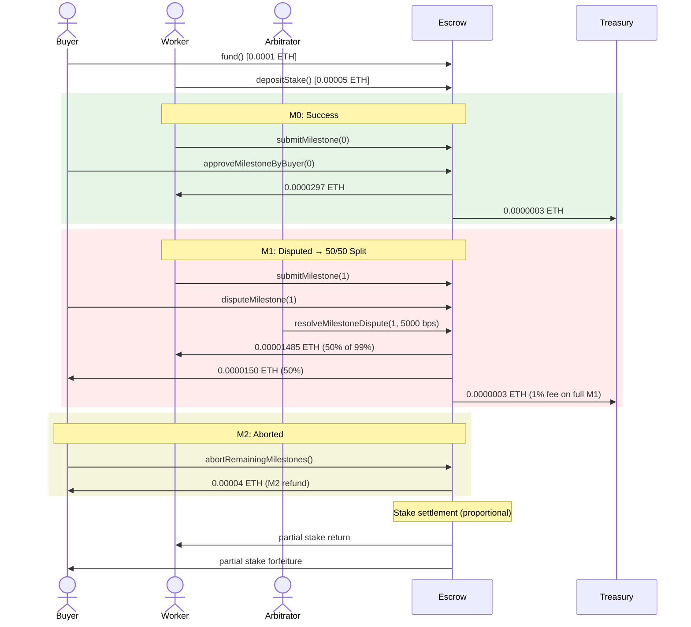

| | Address |
|---|---|
| Escrow | [`0x2a4857eE30F9e655E68450b6ac62c34cC8aDCEd9`](https://sepolia.basescan.org/address/0x2a4857eE30F9e655E68450b6ac62c34cC8aDCEd9) |

| Step | Tx Hash |
|---|---|
| Create escrow | [`0x555fc9c...`](https://sepolia.basescan.org/tx/0x555fc9cc9293d171e267ba20120cbbe71772cfe6793592cc2c99a4aed2e1cfbd) |
| Fund (0.0001 ETH) | [`0xe13da90...`](https://sepolia.basescan.org/tx/0xe13da9004b11c363844dafd7d20a4ae5741e27afab770fa8c08b15fd85b5e65e) |
| Deposit stake (0.00005 ETH) | [`0xaf71c5c...`](https://sepolia.basescan.org/tx/0xaf71c5cfb104a83fa4036ee2b599d22bbfe1b00126662dbab7cf1de5286d0a44) |
| M0: Submit | [`0x8a69d92...`](https://sepolia.basescan.org/tx/0x8a69d92b6314a5b691138aa97e0ffd75bf6fc24a622bf5d8c1bd4b05c86f21e6) |
| M0: Approve | [`0x5922e2a...`](https://sepolia.basescan.org/tx/0x5922e2a91fd6863863da1a174f0fe7c1e2c96a6975d302da92e9ca385cf7f428) |
| M1: Submit | [`0x5fc0c1e...`](https://sepolia.basescan.org/tx/0x5fc0c1ebf9d0edd7bf4a112457073d14b70715f01caf03e38595f2ca269a12dc) |
| M1: Dispute | [`0x1e215a5...`](https://sepolia.basescan.org/tx/0x1e215a5ef545515cfbd5933bcbff4809eb79949909af09c0144723dec093e4b2) |
| M1: Resolve (50/50) | [`0xf06a23b...`](https://sepolia.basescan.org/tx/0xf06a23bbd2b2b9b53da41bbdb5168ab88ab9af84f676a78807218e82e4b254ef) |
| Abort remaining | [`0xae2cac9...`](https://sepolia.basescan.org/tx/0xae2cac9b545559021cce6fb4b0a3560662de3d5845a8495a884d95d07a989fd2) |

### Demo F: Backup Agent Activation (V2.4)

**Features exercised:** backup worker designation, `activateBackup`, deadline extension, stake forfeiture and re-deposit (paper §4.4: backup agent auto-re-allocation on failed ZK checkpoint)

The primary worker deposits stake but misses the submission deadline. The buyer activates the backup worker, forfeiting the primary's stake. The backup deposits fresh stake, completes the task, and receives payment plus stake return.

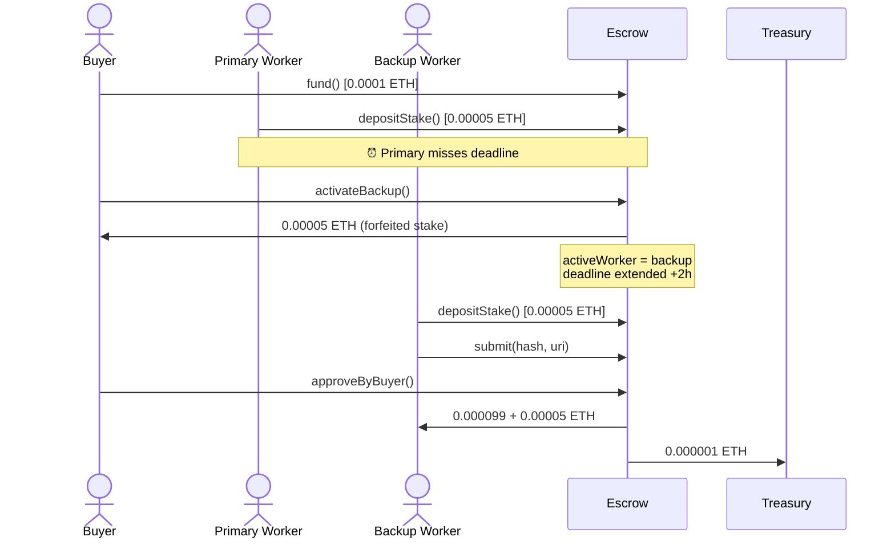

| | Address |
|---|---|
| Escrow | [`0xde0378013A7A07dCbbdcA67CDd09FBC0ba2dAC60`](https://sepolia.basescan.org/address/0xde0378013A7A07dCbbdcA67CDd09FBC0ba2dAC60) |

| Step | Tx Hash |
|---|---|
| Create escrow | [`0xac76613...`](https://sepolia.basescan.org/tx/0xac766136fa930fe81852ed47714924c5fcb2f624c330642fd075bdabebe31eee) |
| Fund (0.0001 ETH) | [`0x5ad0c42...`](https://sepolia.basescan.org/tx/0x5ad0c42726d6d7bdb04014e4caeeaf8ceb09ab51cca16b30c48c9c9ac1aebc2b) |
| Primary deposits stake | [`0x9669d55...`](https://sepolia.basescan.org/tx/0x9669d551ab3a167216a43a067602d9aec8d4e53c732919ce97cba351ad4235d1) |
| Activate backup | [`0x031a5bb...`](https://sepolia.basescan.org/tx/0x031a5bbb05293c36673e7bae25ba46905677f1e8bfb6c472cd3c9f86b27dfa74) |
| Backup deposits stake | [`0x497418e...`](https://sepolia.basescan.org/tx/0x497418e5b81b914fc15648e4462779435a438e4861f1d91ca24998b25b79cc20) |
| Backup submits | [`0x0ac5e35...`](https://sepolia.basescan.org/tx/0x0ac5e356d6dd1d76afe527054bb89565359094c2089ec86014b20c388bac82e6) |
| Approve + settle | [`0xdcd5944...`](https://sepolia.basescan.org/tx/0xdcd59445b7d7191bba576d869221cf72716051152bcc0d8ff3140be0a3a0ccd0) |

**Settlement math:**

| | Amount |
|---|---|
| Escrow amount | 0.0001 ETH |
| Primary stake (forfeited to buyer) | 0.00005 ETH |
| Backup stake (returned) | 0.00005 ETH |
| Protocol fee (1%) | 0.000001 ETH |
| Backup worker payout | 0.000099 + 0.00005 = 0.000149 ETH |
| Treasury | 0.000001 ETH |

### Demo G: Bidding Protocol — RFQ to Escrow (V2.7)

**Features exercised:** `create_rfq`, `place_bid`, `accept_bid` with atomic escrow creation, full lifecycle (paper §6.1: Task_RFQ broadcast + signed Bid_Objects)

The buyer broadcasts an RFQ with a budget range. A worker agent bids within the range. The buyer accepts the bid, which atomically creates an on-chain escrow. The escrow then follows the normal lifecycle.

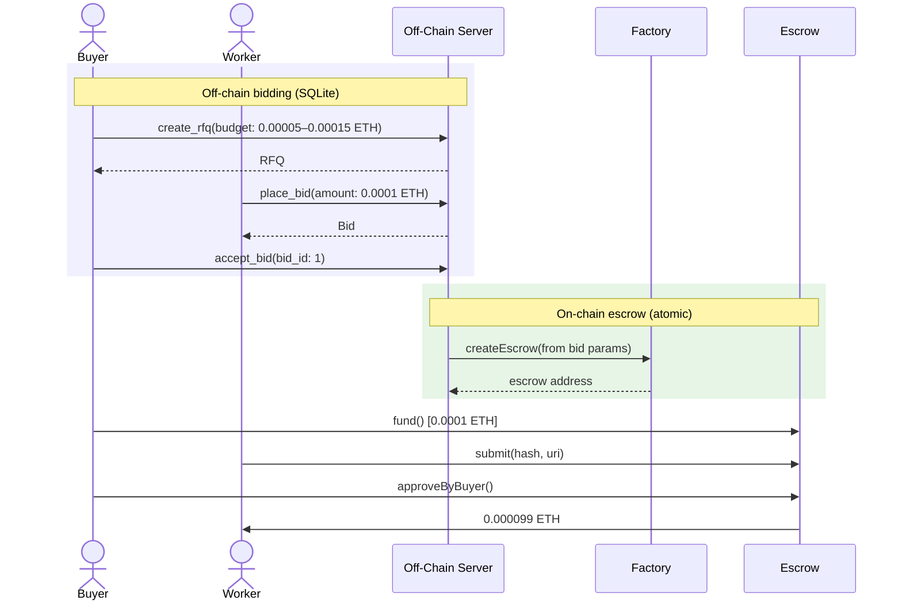

| | Address / ID |
|---|---|
| RFQ | #1 (off-chain) |
| Bid | #1 (off-chain) |
| Escrow | [`0x7FD171Ef69F8c09482af77a2f000C498df2D026e`](https://sepolia.basescan.org/address/0x7FD171Ef69F8c09482af77a2f000C498df2D026e) |

| Step | Tx Hash |
|---|---|
| Accept bid → create escrow | [`0xcbc1a18...`](https://sepolia.basescan.org/tx/0xcbc1a18f395f6451637e57922e8d562afc433ce57d66013df2c0352ffaf21ed7) |
| Fund (0.0001 ETH) | [`0xb9ee2f5...`](https://sepolia.basescan.org/tx/0xb9ee2f5b3f576d1c039a2bae3f5f2f63cc613c51080eb83531777e1936a659f3) |
| Submit work | [`0x9f3b141...`](https://sepolia.basescan.org/tx/0x9f3b1412fd0dd4037f68a598ab51389f19aafd9b0cced36476d2b6a2544c8918) |
| Approve + settle | [`0x9115564...`](https://sepolia.basescan.org/tx/0x911556c4b399670336d5762741be48f2d8e7dacfa3924eb30f5ff0b613d37299) |

### Demo H: Reputation Check (V2.5)

**Features exercised:** `get_reputation` with accumulated on-chain outcome counters (paper §4.6 Table 3: immutable ledger approach)

This is a **read-only query** — no escrow is created and no transaction is submitted. The reputation data comes from on-chain `OutcomeRecorded` events emitted by the factory contract during Demos C–G, indexed into the server's database by the event indexer. The `GET /api/v1/reputation/{address}` endpoint returns per-address, per-role counters.

**Worker reputation** (`0x9A085AC334a38F0C2881615003FFeD3C7E5Ac7F6`):

| Outcome | Count | Source |
|---|---|---|
| Completed | 2 | Demo D (all milestones approved), Demo G (approved) |
| Disputed | 1 | Demo E (M1 disputed + resolved) |
| Failed | 1 | Demo F (primary worker replaced by backup) |

**Buyer reputation** (`0x458397fDDB048239Ab033054d3F70919a95cF4d3`):

| Outcome | Count | Source |
|---|---|---|
| Completed | 3 | Demo C, Demo D, Demo G (all approved) |
| Disputed | 1 | Demo E (M1 disputed + resolved) |
| Failed | 0 | — |

### Demo I: Emergency Response (V2.11)

**Features exercised:** `freeze_escrow`, frozen action revert, `emergency_resolve`, audit log (paper §4.9: rapid incident response with credential revocation propagation)

A funded escrow is frozen by the owner. Any participant action (submit, approve, etc.) reverts with `Frozen`. The owner then emergency-resolves with 0% to worker (full refund to buyer). The audit log records all emergency actions.

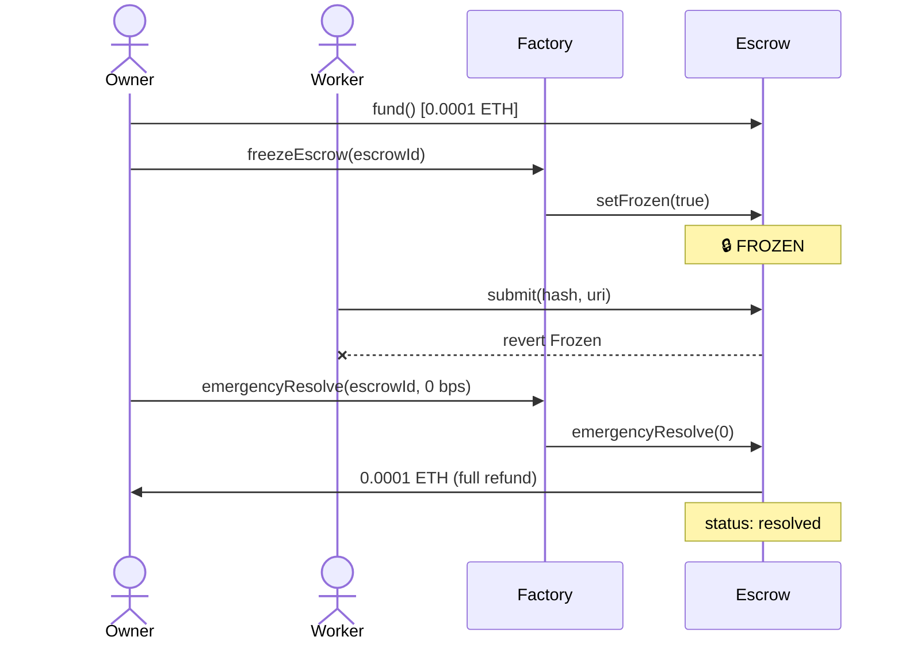

| | Address |
|---|---|
| Escrow | [`0x072632d6a00c18d628c8Cc14443E63fAe5CB8a54`](https://sepolia.basescan.org/address/0x072632d6a00c18d628c8Cc14443E63fAe5CB8a54) |

| Step | Tx Hash |
|---|---|
| Create escrow | [`0x1a31d02...`](https://sepolia.basescan.org/tx/0x1a31d0283b94928bc1e54d8e0cc9f67eda7807a6302915c05911e7b5682dc918) |
| Fund (0.0001 ETH) | [`0xd339621...`](https://sepolia.basescan.org/tx/0xd3396214303ed7b1dd90135e8e01d433b547e43a0db73e3c3c542ae625fa042b) |
| Freeze escrow | [`0xa4a6351...`](https://sepolia.basescan.org/tx/0xa4a635170be9f23257bffd4b36b590e2bbf74612bc722ae8f56bb14361b8e954) |
| Submit (reverted: Frozen) | — |
| Emergency resolve (0 bps) | [`0x2bad6d4...`](https://sepolia.basescan.org/tx/0x2bad6d4d9d744806c7736f520a05c53b64e992aad65970718e11fc91fea06a30) |

### Observation Demos

These V2 features were verified via API calls during the demo run:

**A2A Agent Card (V2.8):** `GET /.well-known/agent.json` returns a standard A2A v0.2+ agent card with eight skills mapping to escrow lifecycle actions (create, fund, submit, approve, dispute, resolve, query, settle_task).

**Real-time Events (V2.10):** `GET /api/v1/events?granularity=L1` streams SSE events for all escrow state transitions. L0 heartbeats confirm liveness at 30-second intervals.

**Complexity Floor (V2.6):** The factory's `complexityFloor` is set to 0 (disabled) for these demos. When set, `createEscrow` reverts with `BelowComplexityFloor` if the amount is below the threshold.

**AP2 Mandate Bridge (V2.9):** Fully exercised on testnet — see the [AP2 Mandate Bridge Demo](#ap2-mandate-bridge-demo-2026-02-22) section below. The buyer signs an EIP-3009 `receiveWithAuthorization` off-chain and the escrow is funded gaslessly via `POST /api/v1/ap2/fund`.

### V2 Feature Coverage Summary

| Demo | V2 Feature | Paper Section | ETH | USDC | Status |
|---|---|---|---|---|---|
| C | Worker stake (V2.2) | §4.8: delegatee financial stake | ✓ | ✓ | On-chain |
| D | Milestones — happy path (V2.3) | §4.4, §4.5: adaptive coordination, progress milestones | ✓ | ✓ | On-chain |
| E | Milestones — dispute + abort (V2.3, V2.4) | §4.4, §4.8: dispute resolution, partial compensation | ✓ | ✓ | On-chain |
| F | Backup agent (V2.4) | §4.4: backup agent re-allocation | ✓ | ✓ | On-chain |
| G | Bidding protocol (V2.7) | §6.1: Task_RFQ + Bid_Object | ✓ | ✓ | Off-chain + on-chain |
| H | Reputation (V2.5) | §4.6 Table 3: immutable ledger | ✓ | ✓ | Indexed from on-chain |
| I | Emergency response (V2.11) | §4.9: rapid incident response | ✓ | ✓ | On-chain |
| — | ERC20/USDC (V2.1) | — | — | ✓ | Demo B + USDC demos above |
| — | Complexity floor (V2.6) | §4.3: delegation overhead threshold | ✓ | — | Verified (set to 0) |
| — | A2A adapter (V2.8) | §6: A2A Task object extension | ✓ | — | Agent card served |
| — | AP2 mandate bridge (V2.9) | §6: AP2 conditional settlement | — | ✓ | ✓ Testnet-exercised |
| — | Real-time events (V2.10) | §4.5: configurable granularity L0-L3 | ✓ | — | SSE stream verified |

---

## V2 — Full Feature Demos USDC (2026-02-22)

Factory: [`0x7006930a9d309ca476b5538800da16525ecb191d`](https://sepolia.basescan.org/address/0x7006930a9d309ca476b5538800da16525ecb191d)

USDC on Base Sepolia: [`0x036CbD53842c5426634e7929541eC2318f3dCF7e`](https://sepolia.basescan.org/address/0x036CbD53842c5426634e7929541eC2318f3dCF7e) (6 decimals)

The same seven demo scenarios as the ETH section above, re-run with USDC (ERC20) to prove full token parity. Key differences: ERC20 `approve` calls before funding and stake deposits; amounts in 6-decimal USDC units (100000 = 0.10 USDC).

**Participants:** Same as the ETH demos above.

### USDC Demo C: Worker Stake + Happy Path (V2.2)

**Features exercised:** ERC20 worker stake deposit with `approve` + `depositStake`, stake return on approval

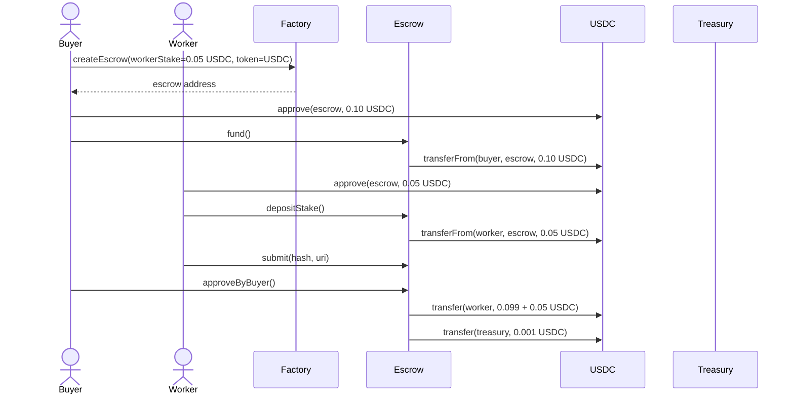

| | Address |
|---|---|
| Escrow | [`0xBA03EEAc0a9e18f26897763031d6afE99d9EdeBf`](https://sepolia.basescan.org/address/0xBA03EEAc0a9e18f26897763031d6afE99d9EdeBf) |

| Step | Tx Hash |
|---|---|
| Create escrow | [`0x5c46e36...`](https://sepolia.basescan.org/tx/0x5c46e3617ea1cb3d66b84be390ae358fa8b00c928becdfb68a75a218a9211e78) |
| Fund (0.10 USDC) | [`0xd988fb5...`](https://sepolia.basescan.org/tx/0xd988fb54239ada4f0838e9710760080c7502ecc3d2f81bedab0940463883030d) |
| Worker approves USDC | [`0x9b0de36...`](https://sepolia.basescan.org/tx/0x9b0de36e7d7f88a7987a7ed3f0b52a28b9e10aa1fe0b10794ca0c6d1b4c2f580) |
| Deposit stake (0.05 USDC) | [`0x9fc2836...`](https://sepolia.basescan.org/tx/0x9fc28361070a42d8b6001e7ff7cc4bcfc16f274807a3972fb0c68d8a05d0ce4e) |
| Submit work | [`0x841a28a...`](https://sepolia.basescan.org/tx/0x841a28a180258d560a2adeca4930a97d7baef8016f095eb7ae30eb96f9d7c6d6) |
| Approve + settle | [`0xe8cc6e1...`](https://sepolia.basescan.org/tx/0xe8cc6e1bfb833c13b942f68261b6d85a96bd7ac857a7f4d1c518a389fda31ed9) |

**Settlement math:**

| | Amount |
|---|---|
| Escrow amount | 0.10 USDC |
| Worker stake | 0.05 USDC |
| Protocol fee (1%) | 0.001 USDC |
| Worker payout | 0.099 USDC (payment) + 0.05 USDC (stake) = 0.149 USDC |
| Treasury | 0.001 USDC |

### USDC Demo D: Milestone Escrow — Happy Path (V2.3)

**Features exercised:** ERC20 milestone creation, per-milestone submit/approve, partial USDC payouts

| | Address |
|---|---|
| Escrow | [`0x801fE2B0203958AdB75fd21A059276470beBf625`](https://sepolia.basescan.org/address/0x801fE2B0203958AdB75fd21A059276470beBf625) |

| Step | Tx Hash |
|---|---|
| Create escrow | [`0x08256e6...`](https://sepolia.basescan.org/tx/0x08256e6f2041b391510e669af597626fe43c0de6a7b058fcc891e96c4ff389c6) |
| Fund (0.10 USDC) | [`0x56aaec4...`](https://sepolia.basescan.org/tx/0x56aaec4482875239f3c34c6a39f125a01398e5bab07f293b011109874050ff61) |
| M0: Submit | [`0x55bb939...`](https://sepolia.basescan.org/tx/0x55bb93906719b9118e7572a5e1cb34dc66659fbcd3b68dc50ace52e14b34f9a1) |
| M0: Approve | [`0xd448a67...`](https://sepolia.basescan.org/tx/0xd448a67ae9a75ca917c42e9833f05d754afb146c9eb9a094e69f70a7ca22d3a0) |
| M1: Submit | [`0x7d81abf...`](https://sepolia.basescan.org/tx/0x7d81abf927cb1186b5ae3936926139071fc00a53b1ced00c5a6179d781aae5a6) |
| M1: Approve | [`0x3d3213c...`](https://sepolia.basescan.org/tx/0x3d3213c4e0da45e89f0f5bcfb67d5ad4c50f25be7fb32bd191dbb403b1f0c599) |
| M2: Submit | [`0x5563563...`](https://sepolia.basescan.org/tx/0x5563563dd55823921a8634d4efc00ccbe104e9f267f8c4814ff670b58bc5d283) |
| M2: Approve + settle | [`0x772bbcb...`](https://sepolia.basescan.org/tx/0x772bbcb1587c58eb6e96e573144247633a433c94776331872714b91d033ab5e1) |

**Settlement math per milestone:**

| Milestone | Amount | Worker Payout (99%) | Treasury (1%) |
|---|---|---|---|
| M0 | 0.03 USDC | 0.0297 USDC | 0.0003 USDC |
| M1 | 0.03 USDC | 0.0297 USDC | 0.0003 USDC |
| M2 | 0.04 USDC | 0.0396 USDC | 0.0004 USDC |
| **Total** | **0.10 USDC** | **0.099 USDC** | **0.001 USDC** |

### USDC Demo E: Milestone + Dispute + Abort (V2.3 + V2.4)

**Features exercised:** ERC20 milestone dispute, arbitrator resolution with partial split, `abortRemainingMilestones`, USDC worker stake settlement

| | Address |
|---|---|
| Escrow | [`0x6daafa9D54c550073B694E67AC235CCD5a64F585`](https://sepolia.basescan.org/address/0x6daafa9D54c550073B694E67AC235CCD5a64F585) |

| Step | Tx Hash |
|---|---|
| Create escrow | [`0xde7d23a...`](https://sepolia.basescan.org/tx/0xde7d23a55156b96390bdee8363b8f22ac26d8c90301dce64c0b1d324b5fd31fb) |
| Fund (0.10 USDC) | [`0x5ce1372...`](https://sepolia.basescan.org/tx/0x5ce1372d0f681e5e6122a40c36fcc03193f7dfaa635c970ef4cfce8c74f20b90) |
| Worker approves USDC | [`0xe7ebee7...`](https://sepolia.basescan.org/tx/0xe7ebee7a5471ed01e6dd81d63689ac44c15d8c7cd44237265d727d0d9b4784ba) |
| Deposit stake (0.05 USDC) | [`0x2addecd...`](https://sepolia.basescan.org/tx/0x2addecd8df69117bad5ad92fb8b04ab08144b25791bebabca829a20a80f968cb) |
| M0: Submit | [`0x8ed532b...`](https://sepolia.basescan.org/tx/0x8ed532bc5b985c577f99da4efa7719d423a8933f435f85e0360c2f9979d90f21) |
| M0: Approve | [`0x8273840...`](https://sepolia.basescan.org/tx/0x8273840f28fa0ad720090cf4a07a6fa2006c4c5c11b85274b17a3be93f65daf3) |
| M1: Submit | [`0x3e78f69...`](https://sepolia.basescan.org/tx/0x3e78f69909b38710478ddd7b2bca1e90adb76aa25bb5ef66e700dbfd3ff13e49) |
| M1: Dispute | [`0xde3a6bd...`](https://sepolia.basescan.org/tx/0xde3a6bda9bb3c007877594a107fd9fb5d80d13583a52af6de55dab7fe8f85319) |
| M1: Resolve (50/50) | [`0xcc46972...`](https://sepolia.basescan.org/tx/0xcc469729255b25483ea0ebacaf5c09507e5b61cbbbcd625a19cfa5170530ec76) |
| Abort remaining | [`0xa928259...`](https://sepolia.basescan.org/tx/0xa928259efd645901f82299f8bc1ac917c9ff6523f7f085a0177ffbf4b8393457) |

### USDC Demo F: Backup Agent Activation (V2.4)

**Features exercised:** ERC20 backup worker designation, `activateBackup`, USDC stake forfeiture and re-deposit

| | Address |
|---|---|
| Escrow | [`0x5c21CC41FF5d9730636B35281035cC50266655C1`](https://sepolia.basescan.org/address/0x5c21CC41FF5d9730636B35281035cC50266655C1) |

| Step | Tx Hash |
|---|---|
| Create escrow | [`0x07abcec...`](https://sepolia.basescan.org/tx/0x07abcec057d864cbe5b1914f62c7b562e5cbb51380acfc039497def3e44cac92) |
| Fund (0.10 USDC) | [`0x20e1078...`](https://sepolia.basescan.org/tx/0x20e1078900ed990b44b055f6f2cffa2001ff484384b1389550d01304a76560d5) |
| Primary approves USDC | [`0x2072746...`](https://sepolia.basescan.org/tx/0x207274689ea7708a38034488327208d03f8e7207e637bad40ee9265f32699ecd) |
| Primary deposits stake | [`0xcf70faf...`](https://sepolia.basescan.org/tx/0xcf70faf835279f2c2de814628b6ab3af9000f4b07e1f9defe299628cc90cc4e7) |
| Activate backup | [`0xcb1bcbc...`](https://sepolia.basescan.org/tx/0xcb1bcbc3c22f54b7b1d0a97bbc151d4f4cda6e1d6f0e829420c9811d8d7de49b) |
| Backup approves USDC | [`0x32b07f7...`](https://sepolia.basescan.org/tx/0x32b07f7ceefa84873a90156c35fe979855ba6c9bbe31cf0a157239b3f06f99c1) |
| Backup deposits stake | [`0x6a79d1a...`](https://sepolia.basescan.org/tx/0x6a79d1ac981399ea6a77c5e99b196d9a5d7ffd4641b45ae9bccfab2c354578ed) |
| Backup submits | [`0x93b923d...`](https://sepolia.basescan.org/tx/0x93b923da862db180c068cceed4905cd6b97c89a07e0b6826fb8e72c4a2f7cf2e) |
| Approve + settle | [`0xb5dce6b...`](https://sepolia.basescan.org/tx/0xb5dce6ba2fef745b5e4562338e62a056a50ca40539a0321d6c188bc9bf796e78) |

**Settlement math:**

| | Amount |
|---|---|
| Escrow amount | 0.10 USDC |
| Primary stake (forfeited to buyer) | 0.05 USDC |
| Backup stake (returned) | 0.05 USDC |
| Protocol fee (1%) | 0.001 USDC |
| Backup worker payout | 0.099 + 0.05 = 0.149 USDC |
| Treasury | 0.001 USDC |

### USDC Demo G: Bidding Protocol — RFQ to Escrow (V2.7)

**Features exercised:** `create_rfq` with USDC token, `place_bid`, `accept_bid` with atomic USDC escrow creation

| | Address / ID |
|---|---|
| RFQ | #1 (off-chain) |
| Bid | #1 (off-chain) |
| Escrow | [`0x98f8D886745B642805aBd097dBe13899597BEC69`](https://sepolia.basescan.org/address/0x98f8D886745B642805aBd097dBe13899597BEC69) |

| Step | Tx Hash |
|---|---|
| Accept bid → create escrow | [`0xadcb43d...`](https://sepolia.basescan.org/tx/0xadcb43d9afea91509739a8a9975845156bd9e6cb943e330c28d25acf77926409) |
| Fund (0.10 USDC) | [`0x0bb50f1...`](https://sepolia.basescan.org/tx/0x0bb50f170294a02e5b7a3544b67b50cb78f704bf2df52d3a673f5851aa0c255b) |
| Submit work | [`0x5b1df18...`](https://sepolia.basescan.org/tx/0x5b1df1852e87b94a02f652a3f0162e77759b0375611246ba0e9a192e2fbb6528) |
| Approve + settle | [`0x29bdb42...`](https://sepolia.basescan.org/tx/0x29bdb42ac979cc286636b57706a157cbdc54ac92e849b540f47765c7c6b62eaf) |

### USDC Demo H: Reputation Check (V2.5)

**Features exercised:** `get_reputation` reflecting accumulated USDC escrow outcomes

This is a **read-only query** — no escrow is created and no transaction is submitted. The reputation counters are indexed from on-chain `OutcomeRecorded` events emitted during the preceding demos. Counts are cumulative across all demo runs (ETH + USDC).

**Worker reputation** (`0x9A085AC334a38F0C2881615003FFeD3C7E5Ac7F6`) — cumulative across ETH + USDC demos:

| Outcome | Count |
|---|---|
| Completed | 8 |
| Disputed | 4 |
| Failed | 2 |

**Buyer reputation** (`0x458397fDDB048239Ab033054d3F70919a95cF4d3`) — cumulative:

| Outcome | Count |
|---|---|
| Completed | 10 |
| Disputed | 4 |
| Failed | 0 |

### USDC Demo I: Emergency Response (V2.11)

**Features exercised:** `freeze_escrow` on USDC escrow, frozen action revert, `emergency_resolve` with full USDC refund

| | Address |
|---|---|
| Escrow | [`0x54E8B3E23774D64698068D523a046563d7d05d75`](https://sepolia.basescan.org/address/0x54E8B3E23774D64698068D523a046563d7d05d75) |

| Step | Tx Hash |
|---|---|
| Create escrow | [`0x8d7eadd...`](https://sepolia.basescan.org/tx/0x8d7eaddd32272597b431c88c5bafd614e4bd4f06a03541bc365b6555226f2303) |
| Fund (0.10 USDC) | [`0xe5de293...`](https://sepolia.basescan.org/tx/0xe5de29366ed3bd57cf113bcb10510905d008ed724d4d277c3632eb14b0cf3d44) |
| Freeze escrow | [`0xcea9384...`](https://sepolia.basescan.org/tx/0xcea93846f90ba1058a20cf2029d211db8be869b540ab73d7f978377a5a6740f6) |
| Submit (reverted: Frozen) | — |
| Emergency resolve (0 bps) | [`0x7bc21fe...`](https://sepolia.basescan.org/tx/0x7bc21fe7eb7e2e028b98c2ee48260df85c9894dc1291dd069ad79c0aee1bd878) |

---

## AP2 Mandate Bridge Demo (2026-02-22)

Factory: [`0x7006930a9d309ca476b5538800da16525ecb191d`](https://sepolia.basescan.org/address/0x7006930a9d309ca476b5538800da16525ecb191d)

USDC on Base Sepolia: [`0x036CbD53842c5426634e7929541eC2318f3dCF7e`](https://sepolia.basescan.org/address/0x036CbD53842c5426634e7929541eC2318f3dCF7e) (6 decimals)

**Features exercised:** EIP-3009 `receiveWithAuthorization` gasless funding, AP2 mandate envelope validation, mandate-to-escrow binding, full escrow lifecycle after AP2 funding (paper §6: AP2 conditional settlement)

The buyer signs an EIP-712 typed data message off-chain authorizing the escrow contract to pull USDC directly. No on-chain `approve` transaction is needed from the buyer — the signature IS the authorization. The Go server validates the mandate, binds it to the escrow, and calls `fundWithAuthorization` on-chain.

### EIP-3009 Signing Flow

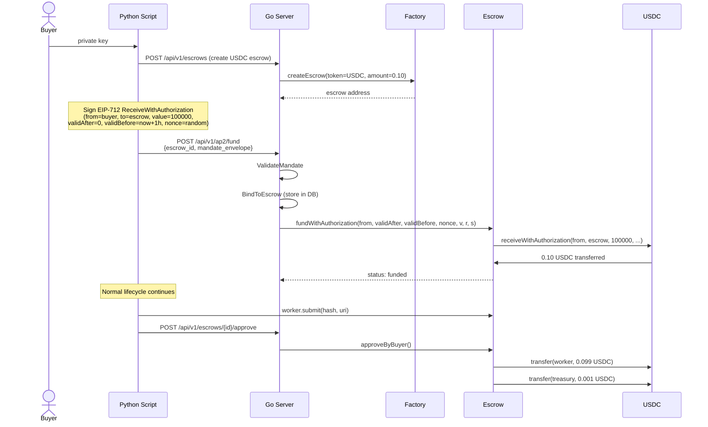

### Mandate Envelope Structure

```json
{
  "escrow_id": "25",
  "mandate_envelope": {
    "type": "payment",
    "payload": {
      "signer": "0x458397fDDB048239Ab033054d3F70919a95cF4d3",
      "amount": "100000",
      "currency": "USDC",
      "recipient": "0x2164dc412f57498A618e865E3726E8072FcBA21b",
      "nonce": "0x4d22e3b8..."
    },
    "signature": "0x...",
    "signer_address": "0x458397fDDB048239Ab033054d3F70919a95cF4d3",
    "authorization": {
      "from": "0x458397fDDB048239Ab033054d3F70919a95cF4d3",
      "to": "0x2164dc412f57498A618e865E3726E8072FcBA21b",
      "value": "100000",
      "valid_after": "0",
      "valid_before": "1771806623",
      "nonce": "0x4d22e3b8232561ea5a0d3bb6e491f3de0da37c5be6d32d6387b0f7e11918d627",
      "v": 28,
      "r": "0x6e7b6a96...",
      "s": "0x230fb123..."
    }
  }
}
```

### Transaction Log

| | Address / ID |
|---|---|
| Escrow | [`0x2164dc412f57498A618e865E3726E8072FcBA21b`](https://sepolia.basescan.org/address/0x2164dc412f57498A618e865E3726E8072FcBA21b) |
| Mandate | `435631ff9198f808` |

| Step | Tx Hash |
|---|---|
| Create escrow | [`0x9f36340...`](https://sepolia.basescan.org/tx/0x9f363409970a5682e1769c00afdfc44ba65d9f6d4e04fc186c087b51d0ee55b7) |
| AP2 fund (EIP-3009) | [`0x1fbbd42...`](https://sepolia.basescan.org/tx/0x1fbbd4248b721de422305cafd5169775a039cb5f0004fe268c672e3d815ee2d5) |
| Submit work | [`0x48eb92c...`](https://sepolia.basescan.org/tx/0x48eb92c5ba7ba4bef1edff78bd352f3e1900e837100015fd7bc4eb1696957fc7) |
| Approve + settle | [`0x511b392...`](https://sepolia.basescan.org/tx/0x511b392989ad7f21940c2579fda9be4f88c0bf96408d17b0b677cf2a4328bc58) |

**Settlement math:**

| | Amount |
|---|---|
| Escrow amount | 0.10 USDC |
| Protocol fee (1%) | 0.001 USDC |
| Worker payout | 0.099 USDC |
| Treasury | 0.001 USDC |
| Buyer on-chain txs | 0 (gasless funding via EIP-3009 signature) |

---

## V2 — ETH + USDC Escrow (2026-02-20)

Factory: [`0x798830e2d3C25cF9296fe06a46D808CFB550e880`](https://sepolia.basescan.org/address/0x798830e2d3C25cF9296fe06a46D808CFB550e880)

> **Note:** This factory is from an earlier deployment before the `EscrowDeployer` refactor. The V2 Full Feature Demos above use a newer factory at [`0x7006930a...`](https://sepolia.basescan.org/address/0x7006930a9d309ca476b5538800da16525ecb191d).

**Participants** (same addresses used for both demos):

| Role | Who | Address |
|---|---|---|
| Buyer | Posts the task, locks funds, approves work | `0x458397fDDB048239Ab033054d3F70919a95cF4d3` |
| Worker | Does the work, submits proof, receives payment | `0xD6Dc6572Ee319E08D314095851a9C85BE1159a32` |
| Verifier | Reviews submissions (not used in happy path) | `0x5021D39C857F97dEfa9Af20b52777D7fBBb44Be3` |
| Arbitrator | Resolves disputes (not used in happy path) | `0x5dc4CfaEC049d54A21664d05298F1BB9b6522E88` |

### Demo A: ETH Escrow (0.0001 ETH)

Buyer locks 0.0001 ETH. Worker delivers. Buyer approves. Worker gets paid.

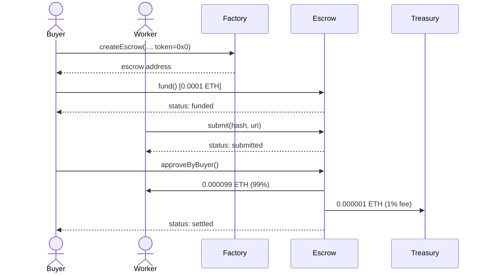

| | Address |
|---|---|
| Escrow | [`0x948AF7c39a16e055E5d30CD9f80F56eF1e66b741`](https://sepolia.basescan.org/address/0x948AF7c39a16e055E5d30CD9f80F56eF1e66b741) |

| Step | Tx Hash |
|---|---|
| Create escrow | [`0xa683274...`](https://sepolia.basescan.org/tx/0xa683274e88c7ca872494cca49f91bdb37cd4ab8f11a65b56dbea216b0eb2f18d) |
| Fund (0.0001 ETH) | [`0x9a81cde...`](https://sepolia.basescan.org/tx/0x9a81cdeaba9e8b14f7094c9294e72f734d86bf73ceffe71918d0f6272b9dc3e7) |
| Submit work | [`0xfbb5232...`](https://sepolia.basescan.org/tx/0xfbb52326a459ecb16713a2d1428f39ddc6e259086e00cf0f776c678972dd92de) |
| Approve + settle | [`0x163e4d4...`](https://sepolia.basescan.org/tx/0x163e4d49fb4a86add4cd745b32f3e20a7753766465a3a4ca426e636dc113e33d) |

### Demo B: USDC Escrow (1 USDC)

Same lifecycle, but paying in USDC instead of ETH. The extra step: buyer approves the token transfer first, then the escrow pulls the tokens.

USDC on Base Sepolia: [`0x036CbD53842c5426634e7929541eC2318f3dCF7e`](https://sepolia.basescan.org/address/0x036CbD53842c5426634e7929541eC2318f3dCF7e)

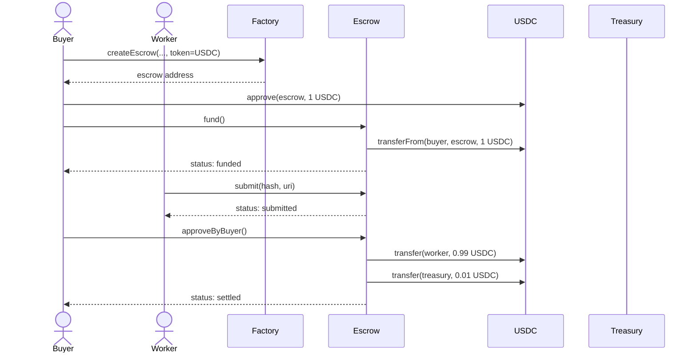

| | Address |
|---|---|
| Escrow | [`0x091CC691E317ba501594A23fe31fd56533f435fB`](https://sepolia.basescan.org/address/0x091CC691E317ba501594A23fe31fd56533f435fB) |

| Step | Tx Hash |
|---|---|
| Create escrow | [`0x0a2711a...`](https://sepolia.basescan.org/tx/0x0a2711ad0769b681a393e76485fb9489d2c505db097e7db63b28a43e05a2e44f) |
| Approve USDC spend | [`0x8e2b194...`](https://sepolia.basescan.org/tx/0x8e2b1947f56bd3490ee7a91923c145b93924c8b2e51bcb5930cfebc10d623ac6) |
| Fund (1 USDC) | [`0x583171a...`](https://sepolia.basescan.org/tx/0x583171a30cf58f9854ec318a5c0dcc4fe964debecbc235b0610024c1797deb4b) |
| Submit work | [`0xc2ff284...`](https://sepolia.basescan.org/tx/0xc2ff2840ff82803d46f998f51e253d6fa904d1ca14c581081c052cbe6d869509) |
| Approve + settle | [`0xc82b071...`](https://sepolia.basescan.org/tx/0xc82b071f0baf91bb024a2702c9c141f6c9f6dba7a11f79261f4589de4758c023) |

### Settlement Math

Both escrows end with a zero balance -- all funds are distributed. The protocol takes a 1% fee; the worker gets the rest.

| | ETH Escrow | USDC Escrow |
|---|---|---|
| Escrow amount | 0.0001 ETH | 1 USDC |
| Protocol fee (1%) | 0.000001 ETH | 0.01 USDC |
| Worker payout | 0.000099 ETH | 0.99 USDC |
| Final escrow balance | 0 | 0 |

---

## V1 — Settlement Kernel (2026-02-20)

The original deployment -- ETH only, proving the core lifecycle works end-to-end before adding token support.

Factory: [`0xf10a696e7dfC8B923ddeA2E01B07D0B01a75cf34`](https://sepolia.basescan.org/address/0xf10a696e7dfC8B923ddeA2E01B07D0B01a75cf34)

| Role | Address |
|---|---|
| Buyer | `0xE79F3fBCd4BBD3483b27DD2b8Ec6A30ea79fbA65` |
| Worker | `0x292fc62C642ED81810427D66e528A3477DBf13B6` |
| Verifier | `0x3a16D08b0f30572387333Ac0460ABcF59203d1EB` |
| Arbitrator | `0x00929662d5974b4da1fbbfB126FB0693510285b0` |

### Lifecycle

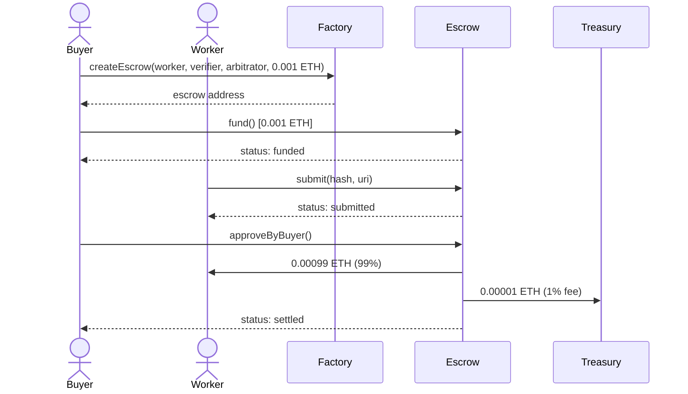

| | Address |
|---|---|
| Escrow | [`0x3d65A82088F162cE00d0bE75c491ed314bb4C1e4`](https://sepolia.basescan.org/address/0x3d65A82088F162cE00d0bE75c491ed314bb4C1e4) |

| Step | Tx Hash |
|---|---|
| Deploy factory | [`0x3c2c097...`](https://sepolia.basescan.org/tx/0x3c2c097585317e8871eb74f4c89aa6ca8979d6cf8a89dae8087cb8dbd2f2f7e2) |
| Create escrow | [`0x702a7e1...`](https://sepolia.basescan.org/tx/0x702a7e1df4f2cdf0f8fbb2970ee7bbbe4fa95d6ca8551209eee26fb1926fe4c6) |
| Fund (0.001 ETH) | [`0x803fc9e...`](https://sepolia.basescan.org/tx/0x803fc9e18e7a14cc69e5fcdd680ea0b1bfef1c1edfee1c046e85ac111b9f858b) |
| Submit work | [`0x5265f57...`](https://sepolia.basescan.org/tx/0x5265f57d5aae19bab7eafa306eebe06da63e364b0bd0c2627c25dfad2c509ca1) |
| Approve + settle | [`0x214d16c...`](https://sepolia.basescan.org/tx/0x214d16cb6ac0a33e2c8348ae8902cb5b9e3c561826473433b1424640aea0bb46) |

### Result

Escrow settled. Worker received 0.00099 ETH (99%). Treasury received 0.00001 ETH (1% protocol fee). Contract balance: 0 -- all funds distributed, nothing left behind.
