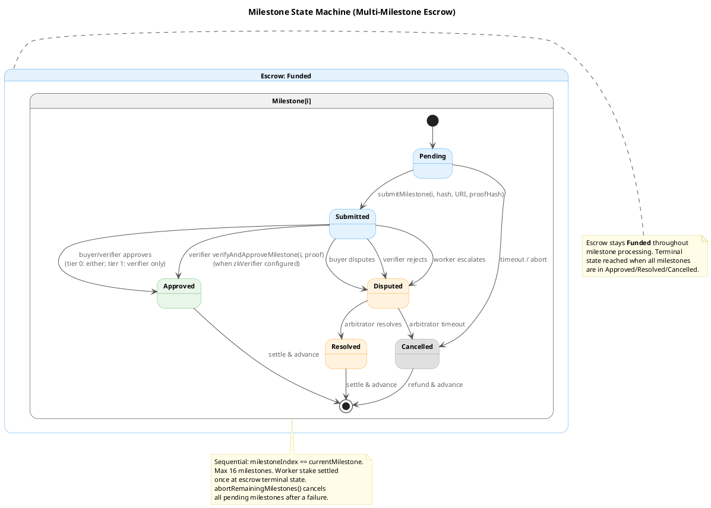
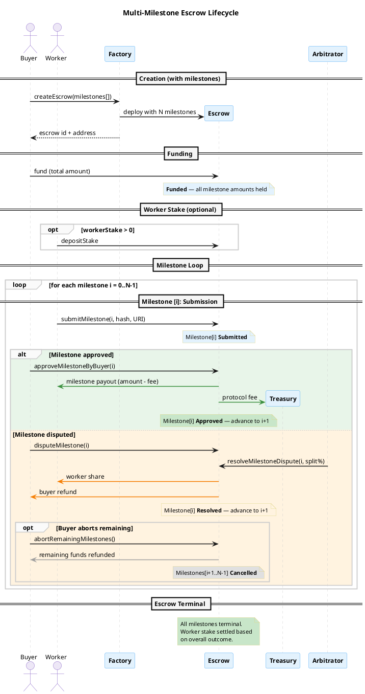
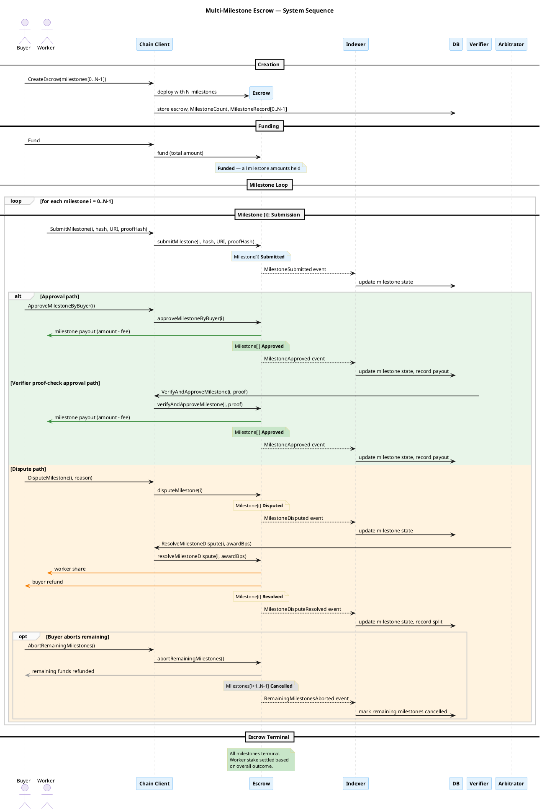
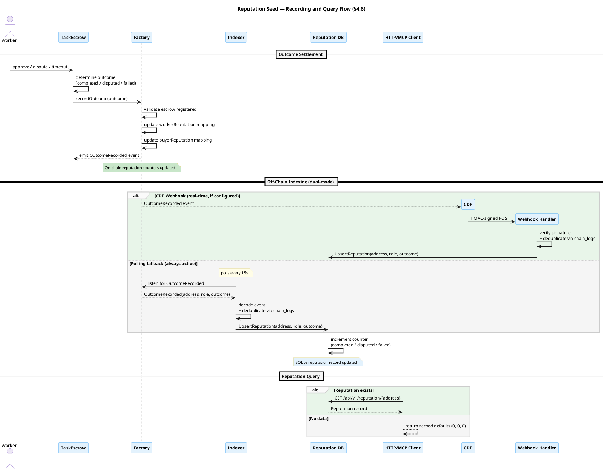
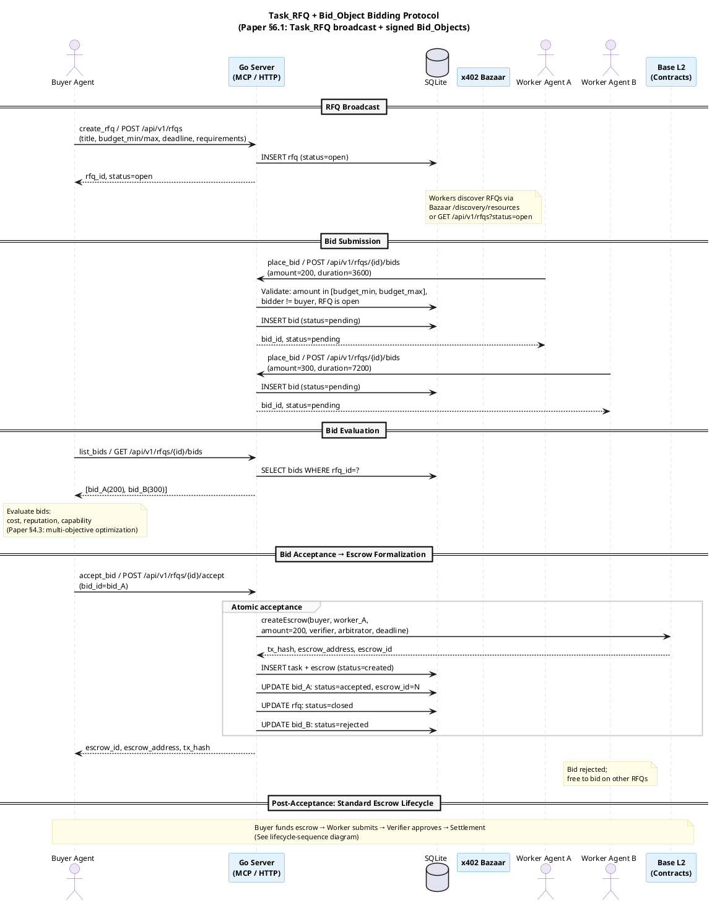

# Architecture

## Overview

This project implements the ["Intelligent AI Delegation"](https://arxiv.org/abs/2602.11865) paper ([DOI](https://doi.org/10.48550/arXiv.2602.11865)) (Tomašev, Franklin, Osindero -- Google DeepMind, 2026) as a working escrow-based delegation marketplace.

The paper defines a comprehensive framework for task decomposition, delegation, verification, and settlement in open agentic economies. This document describes the system architecture, its grounding in the paper's framework, and the scalability path from settlement kernel to full marketplace.

```text
Settlement Kernel (V1)  →  Market Primitives (V2)  →  Delegation Intelligence (V3)  →  Ecosystem Maturity (V4)
     escrow + roles          bidding + reputation        DCTs + ZK + re-delegation       ethics + governance + DIDs
```

Blockchain handles settlement guarantees, auditability, and cryptoeconomic enforcement. Execution, intelligence, matching, and orchestration remain off-chain for speed and flexibility.

### Problem Statement

The paper identifies a critical gap: as AI agents become more capable, the *delegation problem* becomes primary. Not "can the agent do the task" but "how do we trust it did the task correctly, pay it fairly, and hold it accountable?" Current AI delegation flows are fragile and trust-heavy. No existing agent protocol provides conditional settlement, verifiable task completion, or dispute resolution.

- Buyers need assurance they only pay for acceptable outcomes.
- Workers (human or AI) need assurance they will be paid if they deliver.
- The agentic ecosystem needs a neutral, transparent settlement and coordination layer.

### Foundational Concepts

The paper grounds intelligent delegation in concepts from organizational theory and economics that directly inform this architecture:

**Principal-Agent Problem** (paper §2.3). A delegator assigns work to an agent whose motivations may not align with the delegator's. In AI delegation this manifests as reward misspecification, specification gaming, and misaligned sub-goals across delegation chains. Response: smart-contract escrow links payment to verified outcomes, making misalignment financially costly.

**Authority Gradient** (paper §2.3). Significant capability disparities between delegator and delegatee impede communication and produce under-specified requests. In AI systems, sycophancy and instruction-following bias compound this. Response: explicit task spec hashes, structured role boundaries, and verifier/arbitrator review gates create checkpoints that interrupt blind compliance.

**Zone of Indifference** (paper §2.3). Delegatees develop a range of instructions they execute without critical deliberation. In agentic chains (A -> B -> C), a broad zone of indifference allows subtle intent mismatches to propagate. The paper calls for engineering "dynamic cognitive friction." Response: `rejectByVerifier` and `escalateSilence` are on-chain cognitive friction mechanisms -- they force explicit decisions rather than passive acceptance.

**Transaction Cost Economics** (paper §2.3). The overhead of negotiation, monitoring, and uncertainty must be weighed against the value of delegation. Below a certain complexity floor, delegation overhead exceeds task value. Response: protocol fee snapshotting, gas-aware minimum escrow thresholds (V2), and tiered service levels (V3) that match assurance cost to task criticality.

**Contingency Theory** (paper §2.3). There is no universally optimal delegation structure; the right approach depends on task characteristics (complexity, criticality, uncertainty, duration, verifiability, reversibility). Response: the architecture supports progressive reconfiguration -- fixed roles in V1, adaptive coordination in V2, autonomous re-delegation in V3.

### Paper Framework: Five Pillars

The paper defines intelligent delegation across five pillars (Section 4), nine technical protocols, ethical considerations (Section 5), and protocol integration paths (Section 6). This project implements them across versions:

| Pillar | Paper Sections | Core Requirement | Implementation Layer |
|---|---|---|---|
| **Dynamic Assessment** | 4.1, 4.2 | Task decomposition, capability matching, smart-contract formalization | Settlement kernel (V1) → Bidding marketplace (V2) → Decomposition tooling (V3) |
| **Adaptive Execution** | 4.4 | Runtime re-delegation, failure recovery, checkpoint-based re-allocation | Timeout/escalation (V1) → Milestones + backup agents (V2) → Checkpoint/resume (V3) |
| **Structural Transparency** | 4.5, 4.8 | Monitoring (outcome + process), verifiable task completion, attestation chains | Events + hash commitments (V1) → Attestation chains (V2) → ZK verification (V3) |
| **Scalable Market Coordination** | 4.3, 4.6 | Multi-objective optimization, reputation, trust calibration | Designated trust (V1) → Reputation + credentials (V2) → Market stability (V3) |
| **Systemic Resilience** | 4.7, 4.9 | Permission handling, privilege attenuation, security defense-in-depth | Role gates + reentrancy guard (V1) → DCTs + Sybil resistance (V2) → Tiered assurance (V3) |

The paper also defines ethical dimensions (Section 5):

| Ethical Concern | Paper Section | Architectural Response |
|---|---|---|
| Meaningful human control | 5.1 | Buyer/verifier approval gates; cognitive friction via reject + escalation paths |
| Accountability in long chains | 5.2 | Immutable provenance via on-chain event logs; liability firebreaks per escrow |
| Reliability vs efficiency | 5.3 | Tiered service levels (V3): low-assurance (optimistic) vs high-assurance (verified) |
| Social intelligence | 5.4 | Human-compatible interfaces; MCP + HTTP dual surface; structured dispute resolution |
| Risk of de-skilling | 5.6 | Curriculum-aware task routing (V4); hybrid human-AI market support |

### V1 Paper Coverage

V1 implements the financial settlement kernel -- the paper's foundational layer on which subsequent phases build:

| Paper Concept | V1 Implementation |
|---|---|
| Transfer of authority/responsibility/accountability | Immutable buyer/worker/verifier/arbitrator roles with signed on-chain transitions |
| Task constraints and boundaries | Task spec hash, deadlines, review/dispute windows, role-gated actions |
| Verifiability + reversibility axes (§2.2) | Hash commitments, verifier checks, dispute-mediated payout/refund paths |
| Criticality/risk calibration | High-control fixed-role assignments before open market matching |
| Monitoring requirements (§4.5) | Canonical events for every transition, off-chain indexer |
| Trust calibration (§4.6) | Designated verifier/arbitrator identities; financial outcomes auditable |
| Adaptive coordination (§4.4) | Arbitrator timeout prevents permanent fund lock |
| Dynamic cognitive friction (§2.3) | `rejectByVerifier` + `escalateSilence` force explicit decisions |
| Smart contract as settlement (§4.2) | Escrow holds funds; verification clause gates release |
| Dispute resolution (§4.8) | Arbitrator resolves disputes; split payout via basis points |

### V2 Paper Coverage (Milestone-Based Escrow)

Milestone-based escrow extends V1's coverage of the paper's framework:

| Paper Concept | V2 Milestone Implementation |
|---|---|
| Adaptive coordination (§4.4) | Pre-agreed executable clauses: milestones are on-chain checkpoints that enable staged verification and adaptive re-delegation |
| Monitoring via smart contracts (§4.5) | "Smart contracts on blockchain can be used to make the delegatee agent commit to publishing key progress milestones" -- each milestone submission is a committed checkpoint |
| Partial compensation (§6.1) | "Explicit clauses within the smart contract that enable partial compensation, and verification of the task completion percentage" -- per-milestone payouts |
| Verifiable task completion (§4.8) | Each milestone is independently verified before payout, enabling fine-grained verification aligned with task decomposition |
| Contract-first decomposition (§4.1) | Milestones enforce that task decomposition is reflected in the settlement structure -- each sub-task maps to a verifiable, payable milestone |
| Abort and re-delegation (§4.4) | `abortRemainingMilestones()` enables the buyer to exit after a failed milestone, recovering funds for uncompleted work and enabling re-delegation to another agent |
| Backup agent re-allocation (§4.4) | `activateBackup()` replaces the primary worker with a pre-designated backup, extending the deadline and forfeiting the original worker's stake |

### Protocol Integration Strategy

The paper's insight (Section 6): extend existing agent protocols rather than compete with them.

| Protocol | Gap Identified by Paper | Settlement Layer Integration | Phase |
|---|---|---|---|
| **MCP** (Anthropic) | Liability, reputation, trust, conditional settlement | MCP server with escrow tools; future: monitoring stream, DCT-scoped permissions | V1 (complete) |
| **[x402](https://docs.cdp.coinbase.com/x402/welcome)** (Coinbase) | Stateless payment; no conditionality, dispute resolution, or verification | Gasless escrow funding rail (EIP-3009 via facilitator); AP2 mandate funding mechanism; complexity floor calibration | V2 |
| **[x402 Bazaar](https://docs.cdp.coinbase.com/x402/bazaar)** (Coinbase) | Discovery only; no bidding, negotiation, or capability matching | Service discovery substrate for Task_RFQ; credential metadata via Bazaar extensions | V2-V3 |
| **A2A** (Google) | Verification, escrow, conditional settlement | Settlement adapter agent card with `verification_policy` + `escrow_trigger`; Bazaar-discoverable | V2 |
| **AP2** (Google) | Conditional settlement, milestone releases, clawback | Mandate-to-escrow funding bridge via x402 payment rail; stake-on-bid Sybil resistance | V2 |
| **UCP** | Delegation-specific settlement for computational tasks | UCP fulfillment provider exposing escrow lifecycle | V3 |
| **[AgentKit](https://docs.cdp.coinbase.com/agent-kit/welcome)** (Coinbase) | Wallet management and on-chain actions for agents; no delegation lifecycle | Agent wallet provider for multi-tenant signing; escrow actions as custom action provider | V2-V3 |

x402 is an open payment protocol that enables instant stablecoin payments over HTTP by reviving the HTTP 402 status code. Its Bazaar layer provides machine-readable service discovery for payable API endpoints. Both operate on Base in the same ecosystem as this project. x402 provides a stateless, single-interaction payment flow; this project provides a stateful, multi-party delegation lifecycle with conditional settlement. The two are complementary: x402 serves as a payment rail and discovery layer, while the escrow contract governs conditional custody, verification, dispute resolution, and settlement. See the [Roadmap](ROADMAP.md#relationship-to-x402) for a detailed analysis.

[AgentKit](https://docs.cdp.coinbase.com/agent-kit/welcome) is a toolkit that gives AI agents secure wallet management and on-chain capabilities (transfers, swaps, contract interactions) across any AI framework (LangChain, Vercel AI SDK, MCP). It addresses the paper's permission handling requirements (§4.7): agents need their own cryptographic identity to sign transactions, and permissions must be scoped to the immediate task rather than shared via a single server-held key. In V1, the Go server holds one private key and signs all transactions on behalf of every participant. AgentKit provides the migration path: each agent manages its own wallet, signs its own escrow transactions (fund, submit, approve, dispute), and the server shifts to an indexing-only role. The escrow lifecycle could also be packaged as a custom AgentKit action provider, making delegation tools available alongside an agent's existing on-chain capabilities. [Payments MCP](https://docs.cdp.coinbase.com/payments-mcp/welcome) -- Coinbase's MCP server combining AgentKit wallets with x402 payments -- represents the natural client-side complement: agents already running Payments MCP have a wallet and USDC balance ready to fund escrows.

The paper proposes specific protocol extensions (§6.1) that map to the roadmap: `verification_policy` fields on A2A Task objects, monitoring stream extensions for MCP (L0-L3 granularity), Task_RFQ + Bid_Object schemas, Delegation Capability Tokens (DCTs) based on Macaroons/Biscuits, and checkpoint artifact schemas for adaptive re-delegation.

### Integration Paths

Four integration paths, in priority order:

**Path A: MCP settlement server (V1, complete).** Any MCP-compatible agent can use escrow by connecting to the server. The agent does not need Solidity or wallet libraries -- the MCP server handles chain interaction.

**Path B: x402 funding and discovery (V2).** Agents with existing x402 wallets (including [Payments MCP](https://docs.cdp.coinbase.com/payments-mcp/welcome) users) can fund escrows via EIP-3009 gasless transfers through the x402 facilitator. Escrow-backed delegation services are discoverable via Bazaar alongside simple paid APIs, providing a natural on-ramp for agents already in the x402 ecosystem.

**Path C: A2A settlement adapter (V2).** An A2A-compatible agent whose capability is on-chain settlement of delegated work. Other agents discover it via agent cards and Bazaar; it holds funds in escrow and releases them when work is verified.

**Path D: Reference implementation (ongoing).** The paper proposes protocol extensions as "illustrative examples of the kinds of functionalities that would be possible to include in agentic protocols" (§6.1). A working implementation that demonstrates these ideas in practice can serve as a reference for the ecosystem.

---

## System Architecture

```
                                        ┌──────────────┐
                                        │ CDP Webhooks │ (optional)
                                        │  (real-time  │
                                        │  factory     │
                                        │  events)     │
                                        └──────┬───────┘
                                               │ HMAC-signed POST
┌──────────────────────────────────────────────┼──────┐
│                   Go Server Binary            │      │
│                                               │      │
│  ┌─────────────┐  ┌──────────┐  ┌────────────┴──┐   │
│  │  MCP Server  │  │ HTTP API │  │Webhook Handler│   │
│  │   (stdio)    │  │ (JSON)   │  │(/webhooks/cdp)│   │
│  └──────┬───────┘  └────┬─────┘  └───────┬───────┘   │
│         │               │                │           │
│         └───────────┬───┘                │           │
│                     │         ┌───────────────┐      │
│                     │         │ Event Indexer  │      │
│                     │         │ (background    │      │
│                     │         │  poller)       │      │
│                     │         └───────┬───────┘      │
│              ┌──────┴──────┐  ┌──────┴────────┐      │
│              │ Chain Client│  │   SQLite DB    │      │
│              │(go-ethereum)│  │                │      │
│              └──────┬──────┘  └───────────────┘      │
└─────────────────────┼────────────────────────────────┘
                      │
              ┌───────┴────────┐
              │  Base Sepolia  │
              │  Contracts     │
              └────────────────┘
```

### Scope Boundary

**On-chain** (source of financial truth):
- Escrow creation, funding, role assignment
- Deadlines, review/dispute windows
- Submission hash recording
- Approval/rejection/dispute actions
- Final payout/refund decisions
- Protocol fee collection
- Immutable event log

**Off-chain** (execution and intelligence):
- Task content, prompts, large outputs
- Verification logic and rubric execution
- Agent runtime/orchestration
- Matching, search, bidding
- Reputation/risk scoring
- Notifications and dashboards

### Chain Selection: Base (Ethereum L2)

Ethereum mainnet settlement costs $5-$50+ per transaction at typical gas prices. A full happy-path escrow lifecycle requires four transactions (create, fund, submit, approve). On mainnet that is $20-$200 in gas alone before the task has economic value -- making delegation unviable for tasks under hundreds of dollars.

Base is an Optimism OP Stack rollup that inherits Ethereum's security guarantees while reducing transaction costs by approximately 100-1000x. The same four-transaction lifecycle costs roughly $0.01-$0.05 on Base, making escrow viable for tasks worth $1+. The contracts, tooling, and security model are identical -- same Solidity, same EVM, same go-ethereum client library. The difference is cost and finality latency (~2s block time on Base vs ~12s on L1, with L1 finality inherited via the rollup's fraud proof window).

The properties required for settlement -- trustless custody, immutable audit trail, permissionless access, no counterparty risk -- are fully preserved on L2. What L2 sacrifices (longer path to L1-equivalent finality, dependence on the sequencer for liveness) is acceptable for a delegation marketplace where tasks already have multi-hour review windows.

Estimated gas costs per operation on Base (as of early 2026):

| Operation | Estimated Gas | Cost at 0.01 gwei L2 gas |
|---|---|---|
| `createEscrow` (factory) | ~350,000 | < $0.01 |
| `fund` | ~65,000 | < $0.01 |
| `submit` | ~85,000 | < $0.01 |
| `approve` + settle | ~120,000 | < $0.01 |
| **Happy-path total** | **~620,000** | **< $0.02** |
| Dispute + resolve path | ~800,000 | < $0.03 |

> **Note**: Gas costs are estimates and will vary with network congestion and L1 gas prices. Use `cast estimate` or the [Foundry gas estimation tools](https://book.getfoundry.sh/reference/cast/cast-estimate) to check current costs for your transactions.

The **complexity floor** planned for V2 (roadmap item 12) formalizes this: a minimum escrow amount that ensures the task value justifies the gas + protocol fee overhead. On Base, that floor can be low enough ($1-$5) to support micro-delegation between AI agents.

**Chain portability.** The contracts are standard EVM Solidity with no Base-specific dependencies. Deploying to other L2s (Arbitrum, Optimism mainnet, zkSync) or L1 requires only a new RPC URL and chain ID. The Go server's `CHAIN_ID` and `RPC_URL` configuration makes this a deployment decision, not a code change.

### Scalability Assessment

The current architecture -- single Go binary, SQLite, one factory contract -- is deliberately simple for V1. This section assesses which components scale as-is, which require evolution, and what the migration paths look like.

**Components that scale without changes:**

- **On-chain contracts.** Each escrow is an independent contract instance with no shared state bottleneck. The factory is a thin deployer. ETH/ERC20 support and worker-stake anti-Sybil bonding were originally planned for V2 and are now implemented in the current contract baseline. Milestone escrow (V2) extends the escrow contract with per-milestone state tracking and partial payouts; ZK verification slots (V3) add optional proof hashes per submission. Neither changes the factory pattern.
- **On-chain/off-chain boundary.** The design principle -- settle on-chain, everything else off-chain -- is the correct long-term split. Bidding, matching, reputation scoring, task decomposition, and agent orchestration all remain off-chain where they can iterate independently.
- **Go as the server language.** Go's concurrency model, low memory footprint, and single-binary deployment are well-suited through V4+. The go-ethereum client, the MCP SDK, and the HTTP server all scale to high concurrency without architectural changes.
- **MCP + HTTP dual interface.** MCP is the primary agent integration surface; HTTP serves dashboards, external integrations, and tooling. This dual-surface pattern holds through V4 and beyond.

**Components requiring evolution:**

| Component | Current State | Pressure Point | Migration Path | Phase |
|---|---|---|---|---|
| **SQLite** | Single-file embedded DB | Write contention under concurrent marketplace load (bidding, reputation, event indexing) | PostgreSQL. The storage layer uses `database/sql` with hand-written queries -- no ORM lock-in. Swap the driver and adjust SQL dialect differences. | V2 |
| **Event indexer** | Polling every 15s + CDP Webhooks for factory events | Hundreds of active escrows with overlapping lifecycle events; polling lag becomes visible for escrow-level events | CDP Webhooks already deliver factory events in real-time (V2, done). Next: WebSocket subscription (`eth_subscribe`) for escrow events; parallel per-escrow indexing; event bus for internal pub/sub | V2-V3 |
| **Single process** | MCP + API + indexer in one binary | Indexer CPU/memory spikes affecting API latency; MCP stdio transport limits to one connected agent per process | Separate the indexer into its own process. Run multiple MCP server instances behind streamable-HTTP transport. API remains stateless and horizontally scalable. | V2-V3 |
| **Contract deployment** | One `TaskEscrow` per escrow via `CREATE` | Contract deployment gas overhead at high volume; bytecode duplication | Minimal proxy pattern (EIP-1167 clones). The factory deploys proxy contracts pointing to a single `TaskEscrow` implementation. Reduces per-escrow deploy cost by ~90%. | V2 |
| **Nonce management** | Sequential nonce tracking | Concurrent transaction submission causes nonce collisions | Nonce manager with mutex or pending-pool awareness; or separate signing service | V2 |
| **Authentication** | None (server holds a single private key) | Multi-tenant marketplace where different participants sign their own transactions | Agents manage their own wallets via [AgentKit](https://docs.cdp.coinbase.com/agent-kit/welcome) or equivalent and sign escrow transactions directly; server shifts to indexing-only. Alternatively: relayer/meta-transaction model, or ERC-4337 account abstraction. The paper's §4.7 requires each agent to hold scoped credentials and sign its own messages (§4.9). | V2-V3 |
| **Reputation storage** | On-chain seed implemented; off-chain SQLite table | On-chain reputation seed (V2) generates read-heavy query load; behavioral metrics (V3) produce high-write analytical workload | Reputation reads from a materialized view or dedicated read replica. Behavioral metrics use a time-series store or append-only analytics table. | V2-V3 |
| **ZK verification** | Not yet implemented | ZK proof verification on-chain is expensive even on L2 (~300k-500k gas for groth16) | Verify proofs off-chain by default; post only the proof hash on-chain. Optional on-chain verification for high-assurance tasks via a dedicated verifier contract. Consider recursive proofs to amortize cost. | V3 |
| **Cross-chain** | Single-chain (Base) | Agents and liquidity on different L2s | Bridge adapter contracts or cross-chain messaging (LayerZero, Hyperlane). The Go server already parameterizes `CHAIN_ID` and `RPC_URL`, so multi-chain indexing is configuration, not architecture. Settlement contracts deploy per-chain. | V4+ |

**Projected architecture at V4 scale:**

```
                    ┌──────────────────────────────────┐
                    │        Load Balancer              │
                    └──────────┬───────────────────────┘
                               │
              ┌────────────────┼────────────────┐
              │                │                │
    ┌─────────┴──────┐ ┌──────┴───────┐ ┌──────┴───────┐
    │  API Server(s) │ │ MCP Server(s)│ │  A2A Adapter │
    │  (stateless)   │ │ (streamable) │ │  (stateless) │
    └────────┬───────┘ └──────┬───────┘ └──────┬───────┘
             │                │                │
             └────────────────┼────────────────┘
                              │
              ┌───────────────┼───────────────┐
              │               │               │
    ┌─────────┴──────┐ ┌─────┴──────┐ ┌──────┴──────┐
    │   PostgreSQL   │ │  Indexer(s) │ │  Analytics  │
    │  (transactional│ │ (per-chain) │ │ (reputation,│
    │    + replica)  │ │             │ │  metrics)   │
    └────────────────┘ └──────┬──────┘ └─────────────┘
                              │
                    ┌─────────┼─────────┐
                    │         │         │
              ┌─────┴───┐ ┌──┴────┐ ┌──┴────┐
              │  Base   │ │ Arb   │ │  OP   │
              │Contracts│ │Clones │ │Clones │
              └─────────┘ └───────┘ └───────┘
```

None of these migrations require a full rewrite. Each is an incremental change to a specific component behind a stable interface. The storage layer uses `database/sql` -- swap the driver. The chain client is behind an interface -- add chains. The API handlers are stateless -- scale horizontally. The contracts are standard EVM -- deploy anywhere.

The riskiest V4+ item is **cross-chain settlement**, which introduces bridge trust assumptions that partially undermine the trustless escrow guarantee. The mitigation is to keep settlement per-chain (no cross-chain escrow transfers) and handle cross-chain coordination at the off-chain layer.

---

## On-Chain Architecture

### Contracts

- **`TaskEscrowFactory`** (`src/TaskEscrowFactory.sol`) -- creates escrow instances, stores protocol-level configuration (fee basis points, treasury, pause state), and records per-address reputation outcomes (completed/disputed/failed counters for workers and buyers). Delegates `TaskEscrow` deployment to `EscrowDeployer` to stay under the EIP-170 size limit.
- **`EscrowDeployer`** (`src/EscrowDeployer.sol`) -- minimal deployer contract that creates `TaskEscrow` instances on behalf of the factory.
- **`TaskEscrow`** (`src/TaskEscrow.sol`) -- holds escrowed ETH or ERC20, enforces the lifecycle state machine with role-gated transitions.

### State Machine (Single-Shot Escrow)

```text
Created ──fund()──> Funded ──submit()──> Submitted
  │                   │  │  │              │  │  │
  │cancelBeforeFunding│  │  └depositStake()│  │  │
  │                   │  └activateBackup() │  │  │
  v                   │                    │  │  │
Cancelled            claimTimeoutRefund    │  │  │
                      │                    │  │  │
                      v                    │  │  │
                   Refunded <──────────────┘  │  │
                      ^                       │  │
                      │claimArbitratorTimeout │  │
                      │                       │  │
                   Disputed <─────────────────┘  │
                      │    (dispute/reject/      │
                      │     escalateSilence)     │
                      │                          │
                   resolveDispute()              │approve()
                      │                          │
                      v                          v
                   Resolved                   Approved
                      │                          │
                      └───────────┬──────────────┘
                                  │
                                  v
                               Settled
```

When `workerStake > 0`, worker must call `depositStake()` before `submit()`.

Nine states: Created, Funded, Submitted, Approved, Disputed, Resolved, Settled, Refunded, Cancelled.

### Milestone-Based Escrow (V2)

For tasks requiring intermediate verification checkpoints, the escrow supports multiple milestones within a single contract. This implements the paper's adaptive coordination (§4.4) and monitoring (§4.5) requirements: "Smart contracts on blockchain can be used to make the delegatee agent commit to publishing key progress milestones or checkpoints to the blockchain."

**Design rationale.** The paper identifies that static execution plans are insufficient for high-uncertainty or long-duration tasks (§4.4). Milestones provide the on-chain primitive for staged verification: each milestone is a checkpoint where the delegator can verify progress, release partial payment, or trigger adaptive re-delegation. This transforms the escrow from a single-shot settlement into a staged contract with intermediate verification and partial payouts.

**Escrow-level state machine (milestone mode):**

```text
Created ──fund()──> Funded ──[milestone cycling]──> Settled
  │                   │                                │
  │cancelBeforeFunding│                                │
  v                   │                                │
Cancelled            claimTimeoutRefund               Refunded
                      │                                ^
                      v                                │
                   Refunded <── abortRemainingMilestones()
```

**Per-milestone state machine:**

```text
Pending ──submit()──> Submitted
                        │  │  │
                        │  │  └─ approve() ──> Approved (partial payout)
                        │  │
                        │  └─ dispute/reject/escalate ──> Disputed
                        │                                    │
                        │                              resolveDispute()
                        │                                    │
                        │                                    v
                        │                                 Resolved
                        │
                        └─ timeout ──> Cancelled
```



Key properties:
- Milestones are defined at creation and processed in order.
- Each milestone has its own amount, deadline, and review cycle.
- Approved milestones pay out immediately (no waiting for later milestones).
- Worker stake is held for the full escrow duration, settled once when all milestones reach terminal states.
- The buyer can abort remaining milestones after a dispute resolution or timeout, receiving a refund for uncompleted work.
- Single-milestone escrows behave identically to V1 (backward compatibility).





See [`SPEC.md`](SPEC.md) for the state machine, settlement math, and invariants.

### Roles

| Role | Responsibility |
|---|---|
| `buyer` | Funds escrow, approves or disputes, receives refund on failure |
| `worker` | Submits delivery, receives payout on approval |
| `verifier` | Checks submission quality, can approve or reject |
| `arbitrator` | Final authority in disputed cases |
| `treasury` | Receives protocol fee from successful payouts |
| `backupWorker` | Optional pre-designated fallback worker; activated by buyer if primary defaults |

Roles are immutable per escrow in V1 (including `backupWorker`).

### Economics

- Protocol fee: basis points on successful payout (snapshotted at escrow creation to prevent governance races). In milestone mode, the fee is applied per-milestone payout.
- ETH and ERC20 (originally planned for V2, now part of the current baseline).
- `workerStake`: optional anti-Sybil bond the worker deposits before submission (paper §4.8). Set at escrow creation; 0 means no stake required. If approved, the stake is returned to the worker in full; disputed stakes follow the same proportional split as payment; on timeout, arbitrator timeout, or backup activation, the stake is forfeited to the buyer. In milestone mode, stake is held for the full escrow duration and settled once at the end.
- `backupWorker`: optional pre-designated fallback worker (paper §4.4). If the primary worker defaults, the buyer calls `activateBackup()` to replace the active worker, extend the deadline by `backupDeadlineExtension` seconds, and forfeit any deposited stake.
- Milestone payouts: each milestone pays out independently on approval. The buyer funds the full `totalAmount` upfront; partial payouts are released as milestones complete. This reduces capital lock-up risk for the worker while maintaining buyer protection for uncompleted work.
- Complexity floor: factory-level minimum escrow amount (`complexityFloor`), owner-settable via `setComplexityFloor`. Enforced on-chain at `createEscrow` time and off-chain for early rejection. Ensures delegation overhead (gas + protocol fee) doesn't exceed task value (paper §4.3).

### Trust Model

- Smart contract is custodian (not a marketplace operator).
- Verifier/arbitrator identities are the trust substrate in V1.
- All critical state transitions are auditable and replayable via events.

Contract design intent (state machine, settlement math, invariants, paper traceability): [`SPEC.md`](SPEC.md)

---

## Off-Chain Architecture (Go Server)

Single Go binary serving three concerns in one process.

### Package Structure

```
go-server/
  cmd/server/main.go              Entrypoint: wires components, manages lifecycle
  internal/
    config/config.go               Environment variable loading
    chain/
      abi.go                       ABI parsing from embedded Foundry artifacts
      client.go                    go-ethereum ethclient wrapper
      factory.go                   Factory contract binding
      escrow.go                    Escrow contract bindings
    storage/
      db.go                        SQLite open + embedded migration
      models.go                    Go structs
      queries.go                   CRUD operations (database/sql, no ORM)
      migrations/
        001_create_tables.sql      Schema
    indexer/indexer.go             Event polling -> DB reconciliation
    bidding/
      bidding.go                   Shared bidding protocol logic (RFQ + Bid lifecycle)
    mcpserver/
      server.go                    MCP server setup
      tools.go                     16 tool handlers
    api/
      router.go                    HTTP mux with middleware
      handlers.go                  JSON request/response handlers
      webhook.go                   CDP webhook receiver (factory events)
      middleware.go                Logging, recovery, CORS
  abi/
    embed.go                       //go:embed for ABI JSON files
    TaskEscrowFactory.json         Copied from Foundry out/ at build time
    TaskEscrow.json
```

### Chain Client

Wraps `go-ethereum/ethclient` with:
- Private key management and EIP-155 transaction signing
- Nonce tracking with lazy initialization
- Gas estimation per transaction
- ABI-encoded method calls for all factory and escrow functions
- Read-only contract calls for status queries

ABIs are embedded at compile time from Foundry artifacts via `//go:embed`.

### Storage

SQLite via `modernc.org/sqlite` (pure Go, no CGO).

| Table | Purpose |
|---|---|
| `tasks` | Task metadata (title, description, spec hash) |
| `escrows` | Escrow records mirroring on-chain state (includes `milestone_count`, `current_milestone`) |
| `milestones` | Per-milestone records: amount, deadline, status, submission/dispute data (V2) |
| `submissions` | Worker submission records |
| `disputes` | Dispute and resolution records |
| `reputation` | Per-address, per-role outcome counters (completed, disputed, failed) indexed from on-chain events |
| `rfqs` | Task Request for Quote broadcasts (paper §6.1: Task_RFQ) |
| `bids` | Signed Bid_Objects from worker agents (paper §6.1: Bid_Object) |
| `chain_logs` | Raw chain event log (idempotent by tx_hash + log_index) |
| `chain_cursors` | Indexer block cursor per chain |



### Event Indexer (Dual-Mode: Polling + CDP Webhooks)

The indexer reconciles on-chain events into the SQLite database. Two complementary mechanisms handle different event categories:

**Polling indexer** (always active) — background goroutine polling every 15 seconds:

1. Get current block number from RPC
2. Load cursor from DB (or default: current - 250 blocks)
3. Fetch `EscrowCreated` events from factory address
4. For each known escrow, fetch all lifecycle events (~15 event types)
5. Map events to status updates
6. Create submission/dispute records from relevant events
7. Idempotent: skip events already in `chain_logs`
8. Update cursor

After any write transaction (via MCP or API), `RunOnce()` is called synchronously for immediate event pickup.

**CDP Webhooks** (optional, enabled by `CDP_WEBHOOK_SECRET`) — real-time push for factory events:

1. CDP pushes `EscrowCreated` and `OutcomeRecorded` events to `POST /webhooks/cdp` as they occur on-chain
2. The handler verifies the HMAC-SHA256 signature (replay protection via timestamp window)
3. Events are deduplicated via the same `chain_logs` mechanism as the polling indexer
4. Decoded event parameters are written directly to the database

**Why both?** The factory contract (`TaskEscrowFactory`) is a single static address — ideal for a webhook subscription. But each `TaskEscrow` is a dynamically deployed contract at a new address that can't be pre-subscribed. The polling indexer handles all escrow-level events (funded, submitted, approved, disputed, etc.) while webhooks provide near-instant delivery of factory events. The polling indexer also serves as a fallback for factory events if CDP has an outage — deduplication ensures no double-processing.

| Event Category | Source | Delivery | Mechanism |
|---|---|---|---|
| Factory events (`EscrowCreated`, `OutcomeRecorded`) | `TaskEscrowFactory` | Real-time push (webhook) + 15s poll (fallback) | CDP Webhooks + polling indexer |
| Escrow events (~15 types) | Individual `TaskEscrow` contracts | 15s poll | Polling indexer only |

### Bidding Protocol (Task_RFQ + Bid_Object)

The bidding protocol implements the paper's decentralized market mechanism (§4.2, §6.1) where delegators broadcast task requests and agents respond with competitive bids. This is entirely off-chain -- the on-chain escrow creation is the formalization step triggered when a bid is accepted.



**Flow:**
1. Buyer broadcasts a **Task_RFQ** with task spec, budget range, deadline, and requirements
2. Workers discover RFQs via `list_rfqs` / `GET /api/v1/rfqs`
3. Workers submit **Bid_Objects** with proposed price, duration, and reputation bond
4. Buyer evaluates bids (cost, reputation, capability) and accepts one
5. Acceptance atomically creates an on-chain escrow, closes the RFQ, and rejects remaining bids

**Data model:** Two new tables (`rfqs`, `bids`) with status-based lifecycle management. RFQs have budget ranges enabling competitive bidding within buyer constraints. Both RFQs and bids have expiry timestamps checked at read time (no background cleanup needed).

### MCP Tools (Primary Interface)

| Tool | Inputs | Chain Method |
|---|---|---|
| `create_escrow` | title, roles, amount, worker_stake, token, deadlines, milestones, backup_worker, backup_deadline_extension (optional) | `Factory.createEscrow` |
| `fund_escrow` | escrow_id | `Escrow.fund` |
| `deposit_stake` | escrow_id | `Escrow.depositStake` |
| `submit_work` | escrow_id, submission_uri, milestone_index (optional) | `Escrow.submit` / `Escrow.submitMilestone` |
| `approve_work` | escrow_id, role, milestone_index (optional) | `Escrow.approveByBuyer/Verifier` / milestone variants |
| `dispute_work` | escrow_id, role, reason_uri, milestone_index (optional) | `Escrow.dispute/rejectByVerifier/escalateSilence` / milestone variants |
| `resolve_dispute` | escrow_id, worker_award_bps, resolution_uri, milestone_index (optional) | `Escrow.resolveDispute` / milestone variant |
| `abort_milestones` | escrow_id | `Escrow.abortRemainingMilestones` |
| `activate_backup` | escrow_id | `Escrow.activateBackup` |
| `get_escrow` | escrow_id | DB read (includes milestone details) |
| `list_escrows` | role, address, status | DB query |
| `get_reputation` | address, role (optional) | DB read (indexed from on-chain OutcomeRecorded events) |
| `create_rfq` | title, description, buyer, budget_min/max, deadline, expires_at, etc. | DB write (off-chain) |
| `place_bid` | rfq_id, bidder, amount, estimated_duration, expires_at, etc. | DB write (off-chain) |
| `list_bids` | rfq_id or bidder | DB query |
| `accept_bid` | rfq_id, bid_id, caller | `Factory.createEscrow` (on acceptance) |

### HTTP API (Secondary Interface)

| Method | Path | Description |
|---|---|---|
| GET | `/api/v1/health` | Health check |
| POST | `/api/v1/escrows` | Create escrow (optional `milestones` array in body) |
| GET | `/api/v1/escrows` | List (query: role, address, status) |
| GET | `/api/v1/escrows/{id}` | Get escrow (includes milestone details if applicable) |
| POST | `/api/v1/escrows/{id}/fund` | Fund |
| POST | `/api/v1/escrows/{id}/deposit-stake` | Deposit worker stake |
| POST | `/api/v1/escrows/{id}/submit` | Submit work (optional `milestone_index` in body) |
| POST | `/api/v1/escrows/{id}/approve` | Approve (body: role, optional milestone_index) |
| POST | `/api/v1/escrows/{id}/dispute` | Dispute (body: role, reason_uri, optional milestone_index) |
| POST | `/api/v1/escrows/{id}/resolve` | Resolve (body: worker_award_bps, resolution_uri, optional milestone_index) |
| POST | `/api/v1/escrows/{id}/abort-milestones` | Abort remaining milestones (buyer only) |
| POST | `/api/v1/escrows/{id}/activate-backup` | Activate backup worker (buyer only) |
| GET | `/api/v1/reputation/{address}` | Get reputation (query: role) |
| POST | `/api/v1/rfqs` | Create RFQ (Task_RFQ broadcast) |
| GET | `/api/v1/rfqs` | List RFQs (query: status, buyer) |
| GET | `/api/v1/rfqs/{id}` | Get RFQ details with bids |
| POST | `/api/v1/rfqs/{id}/cancel` | Cancel an open RFQ (buyer only) |
| POST | `/api/v1/rfqs/{id}/bids` | Place bid on RFQ |
| GET | `/api/v1/rfqs/{id}/bids` | List bids for RFQ |
| POST | `/api/v1/rfqs/{id}/accept` | Accept bid and create escrow |
| POST | `/webhooks/cdp` | CDP webhook receiver (factory events; requires `CDP_WEBHOOK_SECRET`) |

### Configuration

| Env Var | Required | Default | Description |
|---|---|---|---|
| `RPC_URL` | Yes (for chain ops) | -- | Ethereum JSON-RPC URL |
| `PRIVATE_KEY` | Yes (for writes) | -- | Hex-encoded private key |
| `FACTORY_ADDRESS` | Yes | -- | Deployed factory contract address |
| `CHAIN_ID` | No | `84532` | Chain ID (Base Sepolia) |
| `PORT` | No | `8080` | HTTP server port |
| `DATABASE_URL` | No | `delegation.db` | SQLite database path |
| `MCP_TRANSPORT` | No | -- | Set to `stdio` to enable MCP server |
| `CORS_ORIGINS` | No | `*` (wildcard) | Comma-separated allowed origins; empty = allow all |
| `REQUEST_TIMEOUT` | No | `10s` | Timeout for read-only HTTP requests |
| `TX_TIMEOUT` | No | `90s` | Timeout for chain transaction HTTP requests |
| `COMPLEXITY_FLOOR` | No | -- | Minimum escrow amount (wei/smallest unit) for early rejection; `0` or empty = disabled |
| `CDP_WEBHOOK_SECRET` | No | -- | CDP webhook HMAC secret; enables real-time factory event delivery via `POST /webhooks/cdp` |

### Design Decisions

- **Single binary**: MCP + API + indexer share one process. No message queue or process manager required for V1.
- **Pure Go SQLite**: `modernc.org/sqlite` avoids CGO, simplifying cross-compilation and CI.
- **No ORM**: Six tables, stable schema. `database/sql` with hand-written queries.
- **ABI embedding**: `//go:embed` from files copied at build time (`make go-abi`).
- **Shared logic**: MCP tools and HTTP handlers call the same chain + storage + indexer methods.
- **Synchronous indexer after writes**: `RunOnce()` triggered after transaction submission for immediate event pickup.
- **Dual-mode event ingestion**: CDP Webhooks for real-time factory events + polling for dynamically-deployed escrow contracts. Both paths deduplicate via `chain_logs` (tx_hash + log_index), so overlapping coverage is safe. Webhook mode is opt-in via `CDP_WEBHOOK_SECRET`.
