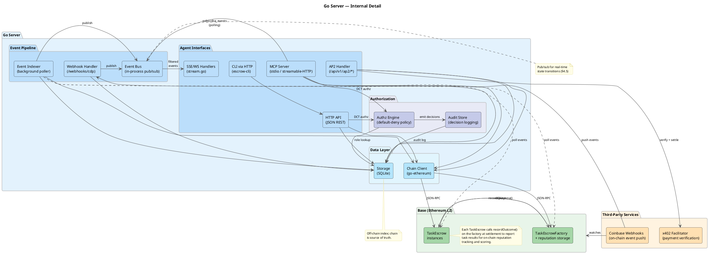

# Architecture

## Purpose

This document is the system map for contributors making structural changes. It explains the durable shape of the project: what lives on-chain, what stays off-chain, which modules own which responsibilities, and which invariants should survive refactors.

Use it together with the other project docs:

| Document | Owns |
|---|---|
| `AGENTS.md` | Repo harness: reading order, working rules, change-coupling expectations |
| `docs/SPEC.md` | Contract state machine, settlement math, invariants, paper traceability |
| `docs/ROADMAP.md` | Delivery order, current phase, and future work |
| `docs/paper-feature-map.json` | Canonical machine-readable paper coverage and status |

Architecture docs are a map, not a substitute for reading the code. They should explain boundaries, ownership, and design pressure, not become a duplicate changelog.

## Reading Path

- Start with `docs/ROADMAP.md` to see the active phase and what work is currently in scope.
- When changing contract behavior, read `docs/SPEC.md` before touching Solidity.
- Read this file front to back if you are changing system shape, shared services, or transport exposure.
- For paper-coverage status or roadmap scope changes, update `docs/ROADMAP.md` and `docs/paper-feature-map.json` with the same change.

## Architectural Thesis

This project implements the ["Intelligent AI Delegation"](https://arxiv.org/abs/2602.11865) paper ([DOI](https://doi.org/10.48550/arXiv.2602.11865)) (Tomašev, Franklin, Osindero -- Google DeepMind, 2026) as an escrow-based delegation marketplace.

The central architectural choice is simple:

- Put money, roles, deadlines, irreversible decisions, and auditability on-chain.
- Keep execution, reasoning, search, matching, verification logic, and large artifacts off-chain.
- Expose the same core capabilities through multiple transports, but keep one shared implementation of the business logic.

```text
Settlement Kernel (V1)  →  Market Primitives (V2)  →  Delegation Intelligence (V3)  →  Ecosystem Maturity (V4)
     escrow + roles          bidding + reputation        DCTs + ZK + re-delegation       ethics + governance + DIDs
```

This separation is the answer to the paper's core problem: buyers need conditional payment, workers need credible payout, and the system needs transparent accountability. Smart contracts provide the settlement kernel; the rest of the delegation stack is allowed to evolve off-chain.

## Architectural Invariants

These rules matter more than specific file names:

- The contracts are the source of financial truth. Off-chain systems may cache, index, or enrich state, but they must not invent a competing settlement ledger.
- `docs/SPEC.md` is the source of truth for settlement states, payout formulas, and role semantics.
- Transport surfaces are adapters. MCP tools, HTTP handlers, and CLI commands should call shared logic rather than fork behavior.
- Externally usable features require interface parity across MCP, HTTP, and CLI unless a documented roadmap-scoped exception is approved with a linked roadmap ticket and owner.
- Large task payloads, prompts, and verification artifacts stay off-chain; the chain stores commitments, checkpoints, and terminal decisions.
- Event indexing is a reconciliation layer. If the database and chain disagree, the chain wins.
- The server is on a path from "unified operator process" toward "coordination and indexing layer." Participant signing should move client-side over time rather than centralizing long-term in the server.
- Documentation updates are coupled to architectural changes. If you change boundaries, state transitions, or system shape, update the docs in the same change.

## System At A Glance


For internal wiring, handler-to-service relationships, and event flow detail, see the detailed diagram:



### Diagram Index

| Diagram | File | Purpose |
|---|---|---|
| System architecture | `docs/diagrams/architecture.png` | Top-level system boundary: contracts, server, storage, and clients |
| Go server detail | `docs/diagrams/architecture-detail.png` | Internal server wiring and shared-component relationships |
| Single-shot state machine | `docs/diagrams/state-machine.png` | Escrow lifecycle for non-milestone settlement |
| Lifecycle sequence | `docs/diagrams/lifecycle-sequence.png` | End-to-end happy path and failure-path sequence |
| Milestone state machine | `docs/diagrams/milestone-state-machine.png` | Staged verification and partial-payout lifecycle |
| Milestone lifecycle | `docs/diagrams/milestone-lifecycle-sequence.png` | Milestone-oriented sequence flow |
| Milestone system sequence | `docs/diagrams/milestone-system-sequence.png` | System interaction view for milestone mode |
| Bidding sequence | `docs/diagrams/bidding-sequence.png` | RFQ, bid, and acceptance flow before escrow formalization |
| Reputation seed sequence | `docs/diagrams/reputation-seed-sequence.png` | On-chain outcome indexing into reputation projections |
| Attestation chain sequence | `docs/diagrams/attestation-chain-sequence.png` | Recursive delegation evidence and custody chain |
| Checkpoint/resume sequence | `docs/diagrams/checkpoint-resume-sequence.png` | Worker handoff and restartable execution flow |
| Quorum sequence | `docs/diagrams/quorum-sequence.png` | Verifier quorum and vote-resolution behavior |

### Current Runtime Shape

| Layer | Owns | Must Not Own |
|---|---|---|
| On-chain (`TaskEscrowFactory`, `EscrowDeployer`, `TaskEscrow`) | Custody, role assignment, deadlines, settlement, fees, immutable event log | Large artifacts, search, orchestration, complex verification logic |
| Go shared services | Lifecycle orchestration, bidding, attestation checks, protocol adapters, indexing | Shadow settlement rules that diverge from the contracts |
| SQLite read model | Query-friendly projections, marketplace metadata, event reconciliation state | Canonical source of escrow truth |
| Transports (MCP, HTTP, CLI, adapters) | Access paths and protocol-specific shapes | Duplicated domain logic |

### Scope Boundary

**On-chain** handles:

- Escrow creation, funding, and role assignment
- Deadlines, review windows, and dispute windows
- Submission commitments and proof-hash recording
- Approval, rejection, dispute, timeout, and final settlement
- Protocol fee collection
- Immutable event emission

**Off-chain** handles:

- Task content, prompts, and large deliverables
- Verification logic and rubric execution
- Matching, search, and bidding UX
- Agent runtime and orchestration
- Reputation/risk scoring views
- Notifications, dashboards, and integration adapters

## Codebase Map

### On-Chain

- `src/TaskEscrowFactory.sol` -- protocol-level configuration, escrow creation, parent/sub-escrow validity, reputation seed, and market-stability controls.
- `src/EscrowDeployer.sol` -- dedicated deployer used to keep factory size under the EIP-170 limit.
- `src/TaskEscrow.sol` -- escrow lifecycle, funding, submission, milestone logic, dispute resolution, and settlement.
- `test/` -- unit, ERC20, fuzz, and invariant coverage for the contracts.

### Off-Chain

- `go-server/internal/escrow/` -- shared escrow orchestration used by multiple transports.
- `go-server/internal/bidding/` -- RFQ, bid, credential checks, and negotiation logic.
- `go-server/internal/attestation/` -- completion-attestation-v1 validation and attestation-chain handling.
- `go-server/internal/indexer/` -- event polling/webhook ingestion and DB reconciliation.
- `go-server/internal/events/` -- in-process event fan-out consumed by SSE/WebSocket/MCP subscribers.
- `go-server/internal/storage/` -- SQLite schema, queries, and read-model persistence.
- `go-server/internal/api/` -- HTTP handlers and middleware.
- `go-server/internal/mcpserver/` -- MCP tool handlers.
- `go-server/cmd/cli/` -- `escrow-cli`, the shell-agent interface.

### Change Guide

| If you change... | You usually also need to change... |
|---|---|
| Contract states, payouts, or roles | `docs/SPEC.md`, Foundry tests, Go ABI copies, diagrams that show lifecycle changes |
| Shared escrow or bidding behavior | MCP handlers, HTTP handlers, CLI commands, transport tests |
| API or tool exposure | All three interfaces, plus `README.md` or setup docs when user-visible behavior changes |
| Major component boundaries or integration strategy | `docs/ARCHITECTURE.md`, sometimes `docs/ROADMAP.md` and `docs/paper-feature-map.json` |
| Roadmap scope or status | `docs/ROADMAP.md` and `docs/paper-feature-map.json` together |

## Paper Grounding

The paper identifies delegation as the primary systems problem once raw capability is no longer the bottleneck. This architecture answers that with a settlement kernel plus progressively richer coordination layers.

| Paper Pillar | Architectural Response |
|---|---|
| Dynamic assessment | RFQ/bid flows, contract-first decomposition, capability and preference metadata |
| Adaptive execution | Timeouts, milestones, backup worker, checkpoint/resume, market-stability controls |
| Structural transparency | Event log, hash commitments, milestone checkpoints, attestation chains, verifier quorum, optional ZK path |
| Scalable market coordination | Reputation seed, complexity floor, credentials, sealed bidding, protocol adapters |
| Systemic resilience | Role gates, reentrancy protection, emergency controls, stake mechanisms, DCT attenuation, principal authz |

The exact implementation status of each paper feature lives in `docs/paper-feature-map.json`. The roadmap owns sequencing and future items; this document focuses on how the implemented pieces fit together.

## Protocol Strategy

The project extends existing agent protocols instead of trying to replace them.

- **MCP** is the native tool surface for MCP-capable agents.
- **CLI + skills** are the default path for shell agents.
- **HTTP** is the coordination and integration surface for dashboards, scripts, and external systems.
- **A2A**, **AP2**, **x402**, **x402 Bazaar**, **UCP**, and **AgentKit** are adapter targets, not alternate settlement kernels.

The core rule is stable: transports may vary, but escrow settlement semantics remain anchored in the contracts.

## Chain Selection: Base (Ethereum L2)

Ethereum mainnet makes four-step delegation flows too expensive for low-value work. Base preserves the EVM, Ethereum security model, and standard tooling while making escrow economically viable for much smaller tasks.

- Same Solidity/EVM/go-ethereum stack as mainnet
- Roughly cent-level happy-path escrow costs on Base rather than dollar-to-tens-of-dollars costs on L1
- Shorter block times suitable for multi-step delegation flows

The complexity floor introduced in V2 formalizes this economics: tasks below a minimum value should not incur escrow overhead.

The contracts are standard EVM Solidity with no Base-specific dependencies. Multi-chain support is a deployment concern plus indexer/storage evolution, not a redesign of the settlement model.

## Scalability And Evolution

The current shape is intentionally simple: single Go binary, SQLite, one factory contract, one chain. That is acceptable for the current phase because the boundaries are already drawn in a way that supports incremental evolution.

Components that already scale with the current architecture:

- Independent escrow contracts with no shared settlement bottleneck
- The on-chain/off-chain split itself
- Go as the server/runtime language
- Multiple interface surfaces over shared logic

Components expected to evolve:

| Component | Current State | Expected Pressure | Likely Migration |
|---|---|---|---|
| Storage | SQLite | Write contention and analytics load | PostgreSQL/read replicas/time-series support |
| Indexing | Polling + webhooks | Higher event volume and lower-latency expectations | WebSocket subscriptions, parallel indexers, event bus |
| Process model | API + MCP + indexer in one binary | Noisy neighbors and transport scaling | Separate indexer process, horizontally scaled API/MCP |
| Contract deployment | One contract per escrow via `CREATE` | Deploy gas overhead | Minimal proxies/clones |
| Signing model | Server-held signer for participant actions | Multi-tenant trust and principal separation | Client-side signing / agent-owned wallets |
| Cross-chain | Base only | Liquidity and agent fragmentation | Per-chain deployments with off-chain coordination |

Projected V4+ runtime shape:

```text
load balancer
  -> stateless API servers
  -> stateless MCP servers
  -> protocol adapters
  -> shared transactional store + replicas
  -> per-chain indexers
  -> per-chain contract deployments
```

None of those changes require replacing the core model. The important architectural decision is already in place: stable domain boundaries with room to change implementation behind them.

## On-Chain Architecture

### Contract Responsibilities

- [`src/TaskEscrowFactory.sol`](../src/TaskEscrowFactory.sol) owns protocol-level configuration, escrow creation, parent/sub-escrow validation, reputation seeding, and market-stability controls.
- [`src/EscrowDeployer.sol`](../src/EscrowDeployer.sol) exists to keep deployment mechanics out of the factory's size budget.
- [`src/TaskEscrow.sol`](../src/TaskEscrow.sol) owns the escrow lifecycle itself: custody, submission, approval, dispute, timeout, milestone progression, stake handling, and terminal settlement.

This split matters because it keeps the per-escrow lifecycle isolated while letting protocol-wide policy evolve at the factory layer.

### Lifecycle Model

The system supports two settlement shapes:

- **Single-shot escrow** for one deliverable and one settlement decision.
- **Milestone escrow** for staged verification and partial payouts.

The detailed state machine and settlement formulas live in [`SPEC.md`](SPEC.md). From an architectural perspective, the important invariants are:

- funds only move through explicit state transitions;
- roles are fixed per escrow;
- milestone mode extends the same settlement model rather than introducing a second contract family;
- high-assurance service tiers remove the optimistic buyer-approval shortcut;
- stake and verifier-bond logic are tied to escrow or verification-cycle boundaries, not free-floating balances.

Relevant diagrams:

- `docs/diagrams/state-machine.png`
- `docs/diagrams/milestone-state-machine.png`
- `docs/diagrams/lifecycle-sequence.png`

### Roles, Trust, And Economics

The trust model is intentionally narrow:

- the contract is the custodian, not the marketplace operator;
- verifier and arbitrator identities provide the human or agent trust substrate;
- every financially relevant transition is evented and replayable.

Economically, the architecture uses tiered fees, optional worker stake, optional verifier stake, backup workers, milestone payouts, and a complexity floor. Those mechanisms are not independent features; together they enforce the paper's claim that delegation assurance should be configurable without undermining settlement determinism.

## Off-Chain Architecture (Go Server)

### Runtime Model

Today the server is a single Go process combining:

- transport surfaces (`MCP`, `HTTP`, CLI-facing API),
- shared domain services,
- event indexing and reconciliation,
- a query-friendly SQLite read model.

That single-process shape is a deployment convenience, not a domain assumption. The architecture is deliberately drawn so the process can be split later without rewriting the core services.

### Module Structure

The code is organized around responsibility boundaries rather than transport boundaries:

- `go-server/internal/chain/` talks to Ethereum and handles ABI-backed contract interaction.
- `go-server/internal/storage/` manages the SQLite schema and read/write queries.
- `go-server/internal/escrow/` is responsible for shared escrow orchestration.
- `go-server/internal/bidding/` covers RFQ, bid, credential, and negotiation logic.
- `go-server/internal/attestation/` performs completion-attestation validation and chain checks.
- `go-server/internal/indexer/` reconciles on-chain events.
- `go-server/internal/events/` provides in-process event fan-out.
- `go-server/internal/api/` and `go-server/internal/mcpserver/` are transport adapters over shared logic.
- `go-server/internal/a2a/`, `go-server/internal/ap2/`, `go-server/internal/ucp/`, and `go-server/internal/x402/` are protocol adapters, not separate business silos.

The intended dependency direction is:

```text
transports/adapters
  -> shared domain services
    -> storage + chain + events
```

Not the reverse.

### Persistence Model

SQLite is a derived operational store, not a second source of truth. The DB exists to support:

- escrow and marketplace queries;
- event cursoring and idempotent reconciliation;
- projections for milestones, bids, reputation, DCTs, attestation chains, checkpoints, and adapters.

The high-level table families are:

- settlement projections: `escrows`, `milestones`, `submissions`, `disputes`;
- market projections: `rfqs`, `bids`, `decompositions`, `decomposition_nodes`;
- trust and authz: `reputation`, `reputation_events`, `dct_tokens`, `dct_authorization_audit`;
- integration state: `a2a_tasks`, `ap2_mandates`, `ucp_sessions`, `ucp_idempotency`;
- chain reconciliation and ops: `chain_logs`, `chain_cursors`, `frozen_addresses`, `emergency_actions`;
- delegation evidence: `attestation_chains`, `attestation_links`, `checkpoints`.

That categorization matters more than the exact schema. If the DB and chain disagree, the chain wins.


### Event Flow

The off-chain system is event-driven around on-chain truth:

```text
client action
  -> chain transaction
  -> indexer/webhook ingestion
  -> SQLite reconciliation
  -> in-process event bus
  -> SSE/WebSocket/MCP consumers
```

Two ingestion mechanisms coexist for structural reasons:

- **Polling** handles escrow contracts, because new escrow addresses are created dynamically.
- **CDP webhooks** accelerate factory-level events, because the factory address is static.

Both paths deduplicate through persisted chain-log identity, so overlap is safe.

### Interface Surfaces

The project exposes one domain model through multiple transports:

- **MCP** for MCP-native agent clients.
- **HTTP** for dashboards, scripts, and external services.
- **CLI** for shell agents through `escrow-cli`.
- **A2A** and **UCP** as adapter surfaces over the same shared orchestration.

Architecturally, the important point is not the exact endpoint list; it is that the transports should remain thin and behaviorally aligned. Exact tool names, routes, and flags are implementation details and should be read from:

- [`go-server/internal/mcpserver/tools.go`](../go-server/internal/mcpserver/tools.go)
- [`go-server/internal/api/router.go`](../go-server/internal/api/router.go)
- [`go-server/cmd/cli/main.go`](../go-server/cmd/cli/main.go)

### Core Domain Services

Several off-chain subsystems are central to the architecture because they add delegation-specific behavior without replacing the settlement kernel:

- **Bidding** keeps price discovery, capability matching, and credential verification off-chain until a winning bid is formalized as an escrow.
- **Contract-first decomposition** validates that task breakdowns remain settlement-compatible before leaf tasks become RFQs.
- **Attestation chains** add transitive accountability for sub-delegation while remaining off-chain evidence rather than on-chain consensus.
- **Checkpoint/resume** adds restartable work handoff for adaptive delegation without changing escrow custody rules.
- **DCT authorization** enforces delegated capability scope off-chain with auditability and strict attenuation.

These systems are intentionally layered beside the escrow contract, not inside it.

### Protocol Adapters

Adapter modules translate external protocols into shared escrow semantics:

- **A2A** exposes settlement capability to A2A agents with escrow-specific metadata.
- **AP2/x402** provides gasless or payment-rail-assisted funding flows into escrow.
- **UCP** projects commerce-oriented checkout flows onto escrow lifecycle semantics.

The architectural rule is that adapters may reshape transport semantics, but they may not bypass verification, dispute, refund, or settlement invariants.

### Operational Controls

A few operational mechanisms deserve mention because they affect system shape:

- emergency controls span on-chain owner actions plus off-chain auditability;
- event streaming supports L0/L1 today, with deeper monitoring levels staged;
- configuration gates optional surfaces such as A2A, UCP, x402, and emergency endpoints.

For exact environment variables and runtime setup, use [`docs/SETUP.md`](SETUP.md) and [`go-server/internal/config/config.go`](../go-server/internal/config/config.go) rather than this document.

## Enduring Decisions

These are the design choices worth preserving through refactors:

- A single settlement kernel anchors all transports and adapters.
- Shared domain logic is preferred over transport-specific implementations.
- Off-chain evidence systems are used when they improve accountability without needing consensus-level enforcement.
- SQLite and the single-binary process are implementation choices, not architectural commitments.
- The system is designed to evolve toward client-side signing and more distributed runtime topology without changing escrow semantics.
