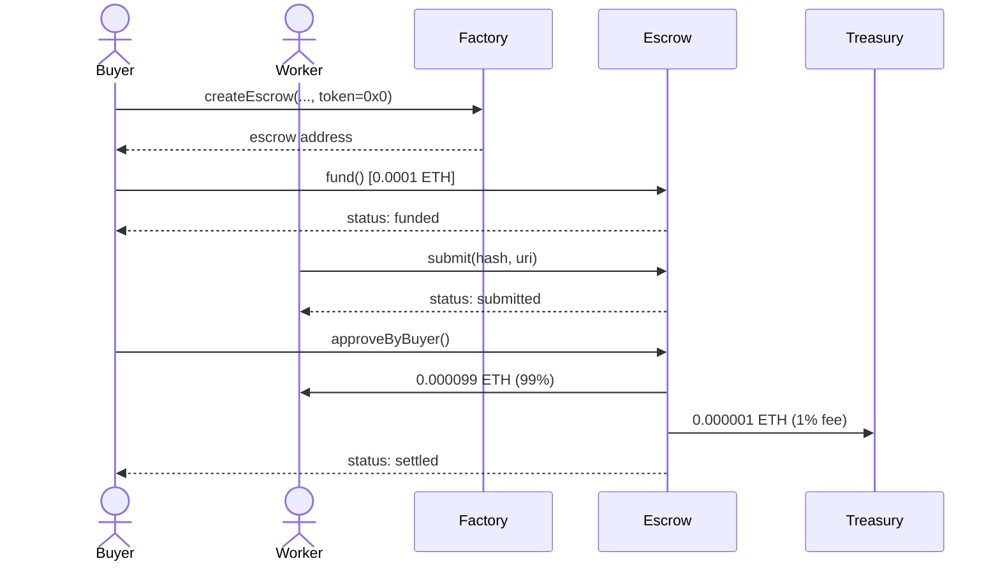
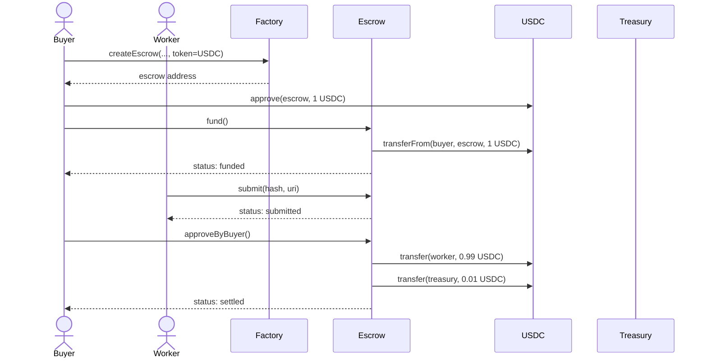
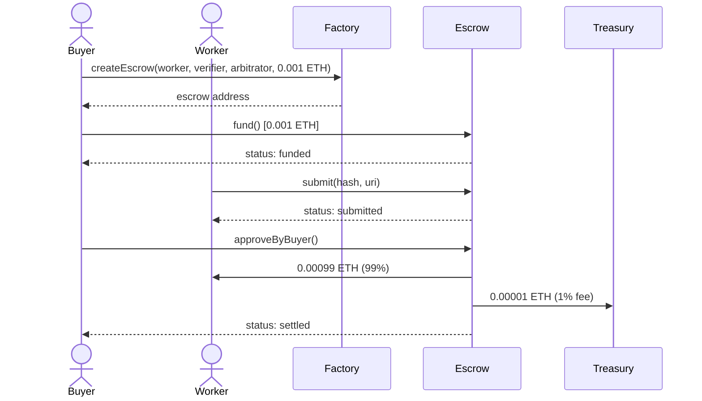

# Live Demo Runs — Base Sepolia

On-chain escrow lifecycle demos executed on Base Sepolia (chain ID 84532). All transactions are verifiable on [BaseScan](https://sepolia.basescan.org).

---

## V2 — ERC20/USDC Support (2026-02-20)

V2 adds ERC20 token support alongside ETH. The same factory and escrow contracts handle both payment types — `token = address(0)` means ETH, any other address means ERC20. This demo runs two escrows back-to-back: one with ETH, one with USDC.

### Factory

| | Address |
|---|---|
| Factory | [`0x798830e2d3C25cF9296fe06a46D808CFB550e880`](https://sepolia.basescan.org/address/0x798830e2d3C25cF9296fe06a46D808CFB550e880) |

### Roles

| Role | Address |
|---|---|
| Buyer | `0x458397fDDB048239Ab033054d3F70919a95cF4d3` |
| Worker | `0xD6Dc6572Ee319E08D314095851a9C85BE1159a32` |
| Verifier | `0x5021D39C857F97dEfa9Af20b52777D7fBBb44Be3` |
| Arbitrator | `0x5dc4CfaEC049d54A21664d05298F1BB9b6522E88` |

### Demo A: ETH Escrow (0.0001 ETH)

Same flow as V1, but through the V2 contract with `token = address(0)`.



| | Address |
|---|---|
| Escrow | [`0x948AF7c39a16e055E5d30CD9f80F56eF1e66b741`](https://sepolia.basescan.org/address/0x948AF7c39a16e055E5d30CD9f80F56eF1e66b741) |

| Step | Tx Hash |
|---|---|
| Create escrow | [`0xa683274...`](https://sepolia.basescan.org/tx/0xa683274e88c7ca872494cca49f91bdb37cd4ab8f11a65b56dbea216b0eb2f18d) |
| Fund (0.0001 ETH) | [`0x9a81cde...`](https://sepolia.basescan.org/tx/0x9a81cdeaba9e8b14f7094c9294e72f734d86bf73ceffe71918d0f6272b9dc3e7) |
| Submit work | [`0xfbb5232...`](https://sepolia.basescan.org/tx/0xfbb52326a459ecb16713a2d1428f39ddc6e259086e00cf0f776c678972dd92de) |
| Approve + settle | [`0x163e4d4...`](https://sepolia.basescan.org/tx/0x163e4d49fb4a86add4cd745b32f3e20a7753766465a3a4ca426e636dc113e33d) |

### Demo B: USDC Escrow (1 USDC) — New in V2

The key difference: buyer approves the USDC token transfer before funding, and the escrow pulls tokens via `transferFrom` instead of receiving ETH via `msg.value`.

USDC on Base Sepolia: [`0x036CbD53842c5426634e7929541eC2318f3dCF7e`](https://sepolia.basescan.org/address/0x036CbD53842c5426634e7929541eC2318f3dCF7e)



| | Address |
|---|---|
| Escrow | [`0x091CC691E317ba501594A23fe31fd56533f435fB`](https://sepolia.basescan.org/address/0x091CC691E317ba501594A23fe31fd56533f435fB) |

| Step | Tx Hash |
|---|---|
| Create escrow | [`0x0a2711a...`](https://sepolia.basescan.org/tx/0x0a2711ad0769b681a393e76485fb9489d2c505db097e7db63b28a43e05a2e44f) |
| Approve USDC spend | [`0x8e2b194...`](https://sepolia.basescan.org/tx/0x8e2b1947f56bd3490ee7a91923c145b93924c8b2e51bcb5930cfebc10d623ac6) |
| Fund (1 USDC) | [`0x583171a...`](https://sepolia.basescan.org/tx/0x583171a30cf58f9854ec318a5c0dcc4fe964debecbc235b0610024c1797deb4b) |
| Submit work | [`0xc2ff284...`](https://sepolia.basescan.org/tx/0xc2ff2840ff82803d46f998f51e253d6fa904d1ca14c581081c052cbe6d869509) |
| Approve + settle | [`0xc82b071...`](https://sepolia.basescan.org/tx/0xc82b071f0baf91bb024a2702c9c141f6c9f6dba7a11f79261f4589de4758c023) |

### Settlement Math

| | ETH Escrow | USDC Escrow |
|---|---|---|
| Escrow amount | 0.0001 ETH | 1 USDC |
| Protocol fee (1%) | 0.000001 ETH | 0.01 USDC |
| Worker payout | 0.000099 ETH | 0.99 USDC |
| Final escrow balance | 0 | 0 |

---

## V1 — Settlement Kernel (2026-02-20)

The original ETH-only deployment. Factory and escrow contracts supported native ETH only.

### Factory

| | Address |
|---|---|
| Factory | [`0xf10a696e7dfC8B923ddeA2E01B07D0B01a75cf34`](https://sepolia.basescan.org/address/0xf10a696e7dfC8B923ddeA2E01B07D0B01a75cf34) |

### Roles

| Role | Address |
|---|---|
| Buyer | `0xE79F3fBCd4BBD3483b27DD2b8Ec6A30ea79fbA65` |
| Worker | `0x292fc62C642ED81810427D66e528A3477DBf13B6` |
| Verifier | `0x3a16D08b0f30572387333Ac0460ABcF59203d1EB` |
| Arbitrator | `0x00929662d5974b4da1fbbfB126FB0693510285b0` |

### Lifecycle



| | Address |
|---|---|
| Escrow | [`0x3d65A82088F162cE00d0bE75c491ed314bb4C1e4`](https://sepolia.basescan.org/address/0x3d65A82088F162cE00d0bE75c491ed314bb4C1e4) |

| Step | Tx Hash |
|---|---|
| Deploy factory | [`0x3c2c097...`](https://sepolia.basescan.org/tx/0x3c2c097585317e8871eb74f4c89aa6ca8979d6cf8a89dae8087cb8dbd2f2f7e2) |
| Create escrow | [`0x702a7e1...`](https://sepolia.basescan.org/tx/0x702a7e1df4f2cdf0f8fbb2970ee7bbbe4fa95d6ca8551209eee26fb1926fe4c6) |
| Fund (0.001 ETH) | [`0x803fc9e...`](https://sepolia.basescan.org/tx/0x803fc9e18e7a14cc69e5fcdd680ea0b1bfef1c1edfee1c046e85ac111b9f858b) |
| Submit work | [`0x5265f57...`](https://sepolia.basescan.org/tx/0x5265f57d5aae19bab7eafa306eebe06da63e364b0bd0c2627c25dfad2c509ca1) |
| Approve + settle | [`0x214d16c...`](https://sepolia.basescan.org/tx/0x214d16cb6ac0a33e2c8348ae8902cb5b9e3c561826473433b1424640aea0bb46) |

### Final State

```json
{
  "status": "settled",
  "amount": "1000000000000000",
  "escrow_address": "0x3d65A82088F162cE00d0bE75c491ed314bb4C1e4"
}
```

Worker received 0.00099 ETH (99%). Treasury received 0.00001 ETH (1% protocol fee). Escrow contract balance: 0.
