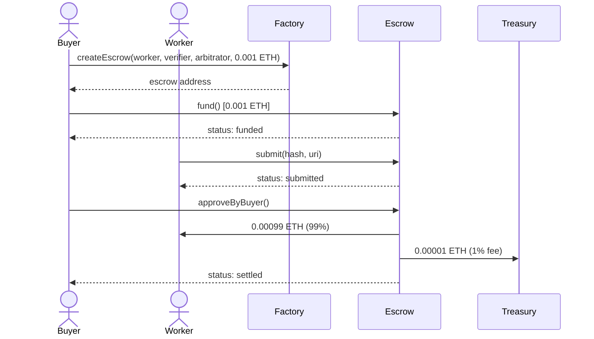

# Live Demo Run — Base Sepolia

Full escrow lifecycle executed on 2026-02-20. All transactions are verifiable on [BaseScan](https://sepolia.basescan.org).

## Lifecycle Diagram



## Contracts

| | Address |
|---|---|
| Factory | [`0xf10a696e7dfC8B923ddeA2E01B07D0B01a75cf34`](https://sepolia.basescan.org/address/0xf10a696e7dfC8B923ddeA2E01B07D0B01a75cf34) |
| Escrow | [`0x3d65A82088F162cE00d0bE75c491ed314bb4C1e4`](https://sepolia.basescan.org/address/0x3d65A82088F162cE00d0bE75c491ed314bb4C1e4) |

## Roles

| Role | Address |
|---|---|
| Buyer | `0xE79F3fBCd4BBD3483b27DD2b8Ec6A30ea79fbA65` |
| Worker | `0x292fc62C642ED81810427D66e528A3477DBf13B6` |
| Verifier | `0x3a16D08b0f30572387333Ac0460ABcF59203d1EB` |
| Arbitrator | `0x00929662d5974b4da1fbbfB126FB0693510285b0` |

## Transactions

| Step | Tx Hash |
|---|---|
| Deploy factory | [`0x3c2c097...`](https://sepolia.basescan.org/tx/0x3c2c097585317e8871eb74f4c89aa6ca8979d6cf8a89dae8087cb8dbd2f2f7e2) |
| Create escrow | [`0x702a7e1...`](https://sepolia.basescan.org/tx/0x702a7e1df4f2cdf0f8fbb2970ee7bbbe4fa95d6ca8551209eee26fb1926fe4c6) |
| Fund (0.001 ETH) | [`0x803fc9e...`](https://sepolia.basescan.org/tx/0x803fc9e18e7a14cc69e5fcdd680ea0b1bfef1c1edfee1c046e85ac111b9f858b) |
| Submit work | [`0x5265f57...`](https://sepolia.basescan.org/tx/0x5265f57d5aae19bab7eafa306eebe06da63e364b0bd0c2627c25dfad2c509ca1) |
| Approve + settle | [`0x214d16c...`](https://sepolia.basescan.org/tx/0x214d16cb6ac0a33e2c8348ae8902cb5b9e3c561826473433b1424640aea0bb46) |

## Final State

```json
{
  "status": "settled",
  "amount": "1000000000000000",
  "escrow_address": "0x3d65A82088F162cE00d0bE75c491ed314bb4C1e4"
}
```

Worker received 0.00099 ETH (99%). Treasury received 0.00001 ETH (1% protocol fee). Escrow contract balance: 0.
